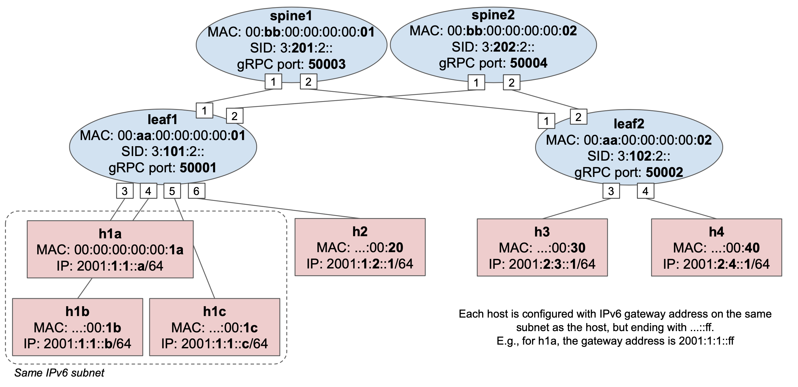

# Exercise 1: P4Runtime Basics

This exercise provides a hands-on introduction to the P4Runtime API. You will be
asked to:

1. Look at the P4 starter code
2. Compile it for the BMv2 software switch and understand the output (P4Info
   and BMv2 JSON files)
3. Start Mininet with a 2x2 topology of `stratum_bmv2` switches
4. Use the P4Runtime Shell to manually insert table entries in one of the
   switches to provide connectivity between hosts

## 1. Look at the P4 program

To get started, let's have a look a the P4 program:
[p4src/main.p4](p4src/main.p4)

In the rest of the exercises, you will be asked to build a leaf-spine data
center fabric based on IPv6. To make things easier, we provide a starter P4
program which contains:

* Header definitions
* Parser implementation
* Ingress and egress pipeline implementation (incomplete)
* Checksum verification/update

The implementation already provides logic for L2 bridging and ACL behaviors. We
suggest you start by taking a **quick look** at the whole program to understand
its structure. When you're done, try answering the following questions, while
referring to the P4 program to understand the different parts in more details.

**Parser**

* List all the protocol headers that can be extracted from a packet.
* Which header is expected to be the first one when parsing a new packet

**Ingress pipeline**

* For the L2 bridging case, which table is used to replicate NDP requests to
  all host-facing ports? What type of match is used in that table?
* In the ACL table, what's the difference between `send_to_cpu` and
  `clone_to_cpu` actions?
* In the apply block, what is the first table applied to a packet? Are P4Runtime
  packet-out treated differently?

**Egress pipeline**

* For multicast packets, can they be replicated to the ingress port?

**Deparser**

* What is the first header to be serialized on the wire and in which case?

## 2. Compile P4 program

The next step is to compile the P4 program for the BMv2 `simple_switch` target.
For this, we will use the open source P4_16 compiler ([p4c][p4c]) which includes
a backend for this specific target, named `p4c-bm2-ss`.

To compile the program, open a terminal window in the exercise VM and type the
following command:

```
make p4-build
```

You should see the following output:

```
*** Building P4 program...
docker run --rm -v /home/sdn/ngsdn-tutorial:/workdir -w /workdir
 opennetworking/p4c:stable \
                p4c-bm2-ss --arch v1model -o p4src/build/bmv2.json \
                --p4runtime-files p4src/build/p4info.txt --Wdisable=unsupported \
                p4src/main.p4
*** P4 program compiled successfully! Output files are in p4src/build
```

We have instrumented the Makefile to use a containerized version of the
`p4c-bm2-ss` compiler. If you look at the arguments when calling `p4c-bm2-ss `,
you will notice that we are asking the compiler to:

* Compile for the v1model architecture (`--arch` argument);
* Put the main output in `p4src/build/bmv2.json` (`-o`);
* Generate a P4Info file in `p4src/build/p4info.txt` (`--p4runtime-files`);
* Ignore some warnings about unsupported features (`--Wdisable=unsupported`).
  It's ok to ignore such warnings here, as they are generated because of a bug
  in p4c.

### Compiler output

#### bmv2.json

This file defines a configuration for the BMv2 `simple_switch` target in JSON
format. When `simple_switch` receives a new packet, it uses this configuration
to process the packet in a way that is consistent with the P4 program.

This is quite a big file, but don't worry, there's no need to understand its
content for the sake of this exercise. If you want to learn more, a
specification of the BMv2 JSON format is provided here:
<https://github.com/p4lang/behavioral-model/blob/master/docs/JSON_format.md>

#### p4info.txt

This file contains an instance of a P4Info schema for our P4 program, expressed
using the Protobuf Text format.

Take a look at this file and try to answer the following questions:

1. What is the fully qualified name of the `l2_exact_table`? What is its numeric
   ID?
2. To which P4 entity does the ID `16812802` belong to? A table, an action, or
   something else? What is the corresponding fully qualified name?
3. For the `IngressPipeImpl.set_egress_port` action, how many parameters are
   defined for this action? What is the bitwidth of the parameter named
   `port_num`?
4. At the end of the file, look for the definition of the
   `controller_packet_metadata` message with name `packet_out` at the end of the
   file. Now look at the definition of `header cpu_out_header_t` in the P4
   program. Do you see any relationship between the two?

## 3. Start Mininet topology

It's now time to start an emulated network of `stratum_bmv2` switches. We will
program one of the switches using the compiler output obtained in the previous
step.

To start the topology, use the following command:

```
make start
```

This command will start two Docker containers, one for mininet and one for ONOS.
You can ignore the ONOS one for now, we will use that in exercises 3 and 4.

To make sure the container is started without errors, you can use the `make
mn-log` command to show the Mininet log. Verify that you see the following
output (press Ctrl-C to exit):

```
$ make mn-log
docker-compose logs -f mininet
Attaching to mininet
mininet    | *** Error setting resource limits. Mininet's performance may be affected.
mininet    | *** Creating network
mininet    | *** Adding hosts:
mininet    | h1a h1b h1c h2 h3 h4
mininet    | *** Adding switches:
mininet    | leaf1 leaf2 spine1 spine2
mininet    | *** Adding links:
mininet    | (h1a, leaf1) (h1b, leaf1) (h1c, leaf1) (h2, leaf1) (h3, leaf2) (h4, leaf2) (spine1, leaf1) (spine1, leaf2) (spine2, leaf1) (spine2, leaf2)
mininet    | *** Configuring hosts
mininet    | h1a h1b h1c h2 h3 h4
mininet    | *** Starting controller
mininet    |
mininet    | *** Starting 4 switches
mininet    | leaf1 stratum_bmv2 @ 50001
mininet    | leaf2 stratum_bmv2 @ 50002
mininet    | spine1 stratum_bmv2 @ 50003
mininet    | spine2 stratum_bmv2 @ 50004
mininet    |
mininet    | *** Starting CLI:
```

You can ignore the "*** Error setting resource limits...".

The parameters to start the mininet container are specified in
[docker-compose.yml](docker-compose.yml). The container is configured to execute
the topology script defined in [mininet/topo-v6.py](mininet/topo-v6.py).

The topology includes 4 switches, arranged in a 2x2 fabric topology, as well as
6 hosts attached to leaf switches. 3 hosts `h1a`, `h1b`, and `h1c`, are
configured to be part of the same IPv6 subnet. In the next step you will be
asked to use P4Runtime to insert table entries to be able to ping between
two hosts of this subnet.



### stratum_bmv2 temporary files

When starting the Mininet container, a set of files related to the execution of
each `stratum_bmv2` instance is generated in the
`tmp`directory. Examples include:

* `tmp/leaf1/stratum_bmv2.log`: contains the stratum_bmv2 log for switch
  `leaf1`;
* `tmp/leaf1/chassis-config.txt`: the Stratum "chassis config" file used to
   specify the initial port configuration to use at switch startup; This file is
   automatically generated by the `StratumBmv2Switch` class invoked by
   [mininet/topo-v6.py](mininet/topo-v6.py).
* `tmp/leaf1/write-reqs.txt`: a log of all P4Runtime write requests processed by
  the switch (the file might not exist if the switch has not received any write
  request).

## 4. Program leaf1 using P4Runtime

For this part we will use the [P4Runtime Shell][p4runtime-sh], an interactive
Python CLI that can be used to connect to a P4Runtime server and can run
P4Runtime commands. For example, it can be used to create, read, update, and
delete flow table entries.

The shell can be started in two modes, with or without a P4 pipeline config. In
the first case, the shell will take care of pushing the given pipeline config to
the switch using the P4Runtime `SetPipelineConfig` RPC. In the second case, the
shell will try to retrieve the P4Info that is currently configured in the switch.

In both cases, the shell makes use of the P4Info file to:
* allow specifying runtime entities such as table entries using P4Info names
  rather then numeric IDs (much easier to remember and read);
* provide autocompletion;
* validate the CLI commands.

Finally, when connecting to a P4Runtime server, the specification mandates that
we provide a mastership election ID to be able to write state, such as the
pipeline config and table entries.

To connect the P4Runtime Shell to `leaf1` and push the pipeline configuration
obtained before, use the following command:

```
util/p4rt-sh --grpc-addr localhost:50001 --config p4src/build/p4info.txt,p4src/build/bmv2.json --election-id 0,1
```

`util/p4rt-sh` is a simple Python script that invokes the P4Runtime Shell
Docker container with the given arguments. For a list of arguments you can type
`util/p4rt-sh --help`.

**Note:** we use `--grpc-addr localhost:50001` as the Mininet container is
executed locally, and `50001` is the TCP port associated to the gRPC server
exposed by `leaf1`.

If the shell started successfully, you should see the following output:

```
*** Connecting to P4Runtime server at host.docker.internal:50001 ...
*** Welcome to the IPython shell for P4Runtime ***
P4Runtime sh >>>
```

#### Available commands

Use commands like `tables`, `actions`, `action_profiles`, `counters`,
`direct_counters`, and other named after the P4Info message fields, to query
information about P4Info objects.

Commands such as `table_entry`, `action_profile_member`, `action_profile_group`,
`counter_entry`, `direct_counter_entry`, `meter_entry`, `direct_meter_entry`,
`multicast_group_entry`, and `clone_session_entry`, can be used to read/write
the corresponding P4Runtime entities.

Type the command name followed by `?` for information on each command,
e.g. `table_entry?`.

For more information on P4Runtime Shell, check the official documentation at:
<https://github.com/p4lang/p4runtime-shell>

The shell supports autocompletion when pressing `tab`. For example:

```
tables["IngressPipeImpl.<tab>
```

will show all tables defined inside the `IngressPipeImpl` block.

### Bridging connectivity test

Use the following steps to verify connectivity on leaf1 after inserting the
required P4Runtime table entries. For this part, you will need to use the
Mininet CLI.

On a new terminal window, attach to the Mininet CLI using `make mn-cli`.

You should see the following output:

```
*** Attaching to Mininet CLI...
*** To detach press Ctrl-D (Mininet will keep running)
mininet>
```

### Insert static NDP entries

To be able to ping two IPv6 hosts in the same subnet, first, the hosts need to
resolve their respective MAC address using the Neighbor Discovery Protocol
(NDP). This is equivalent to ARP in IPv4 networks. For example, when trying to
ping `h1b` from `h1a`, `h1a` will first generate an NDP Neighbor Solicitation
(NS) message to resolve the MAC address of `h1b`. Once `h1b` receives the NDP NS
message, it should reply with an NDP Neighbor Advertisement (NA) with its own
MAC address. Now both host are aware of each other MAC address and the ping
packets can be exchanged.

As you might have noted by looking at the P4 program before, the switch should
be able to handle NDP packets if correctly programmed using P4Runtime (see
`l2_ternary_table`), however, **to keep things simple for now, let's insert two
static NDP entries in our hosts.**

Add an NDP entry to `h1a`, mapping `h1b`'s IPv6 address (`2001:1:1::b`) to its
MAC address (`00:00:00:00:00:1B`):

```
mininet> h1a ip -6 neigh replace 2001:1:1::B lladdr 00:00:00:00:00:1B dev h1a-eth0
```

And vice versa, add an NDP entry to `h1b` to resolve `h1a`'s address:

```
mininet> h1b ip -6 neigh replace 2001:1:1::A lladdr 00:00:00:00:00:1A dev h1b-eth0
```

### Start ping

Start a ping between `h1a` and `h1b`. It should not work as we have not inserted
any P4Runtime table entry for forward these packets.

```
mininet> h1a ping h1b
```

You should see no output form the ping command. You can leave that command
running for now.

### Insert P4Runtime table entries

To be able to forward ping packets, we need to add two table entries on
`l2_exact_table` in `leaf1` -- one that matches on destination MAC address
of `h1b` and forwards traffic to port 4 (where `h1b` is attached), and
vice versa (`h1a` is attached to port 3).

Let's use the P4Runtime shell to create and insert such entries. Looking at the
P4Info file, use the commands below to insert the following two entries in the
`l2_exact_table`:

| Match (Ethernet dest) | Egress port number  |
|-----------------------|-------------------- |
| `00:00:00:00:00:1B`   | 4                   |
| `00:00:00:00:00:1A`   | 3                   |

To create a table entry object:

```
P4Runtime sh >>> te = table_entry["P4INFO-TABLE-NAME"](action = "<P4INFO-ACTION-NAME>")
```

Make sure to use the fully qualified name for each entity, e.g.
`IngressPipeImpl.l2_exact_table`, `IngressPipeImpl.set_egress_port`, etc.

To specify a match field:

```
P4Runtime sh >>> te.match["P4INFO-MATCH-FIELD-NAME"] = ("VALUE")
```

`VALUE` can be a MAC address expressed in Colon-Hexadecimal notation
(e.g., `00:11:22:AA:BB:CC`), or IP address in dot notation, or an arbitrary
string. Based on the information contained in the P4Info, P4Runtime shell will
internally convert that value to a Protobuf byte string.

The specify the values for the table entry action parameters:

```
P4Runtime sh >>> te.action["P4INFO-ACTION-PARAM-NAME"] = ("VALUE")
```

You can show the table entry object in Protobuf Text format, using the `print`
command:

```
P4Runtime sh >>> print(te)
```

The shell internally takes care of populating the fields of the corresponding
Protobuf message by using the content of the P4Info file.

To insert the entry (this will issue a P4Runtime Write RPC to the switch):

```
P4Runtime sh >>> te.insert()
```

To read table entries from the switch (this will issue a P4Runtime Read RPC):

```
P4Runtime sh >>> for te in table_entry["P4INFO-TABLE-NAME"].read():
            ...:     print(te)
            ...:
```

After inserting the two entries, ping should work. Go pack to the Mininet CLI
terminal with the ping command running and verify that you see an output similar
to this:

```
mininet> h1a ping h1b
PING 2001:1:1::b(2001:1:1::b) 56 data bytes
64 bytes from 2001:1:1::b: icmp_seq=956 ttl=64 time=1.65 ms
64 bytes from 2001:1:1::b: icmp_seq=957 ttl=64 time=1.28 ms
64 bytes from 2001:1:1::b: icmp_seq=958 ttl=64 time=1.69 ms
...
```

## Congratulations!

You have completed the first exercise! Leave Mininet running, as you will need it
for the following exercises.

[p4c]: https://github.com/p4lang/p4c
[p4runtime-sh]: https://github.com/p4lang/p4runtime-shell
