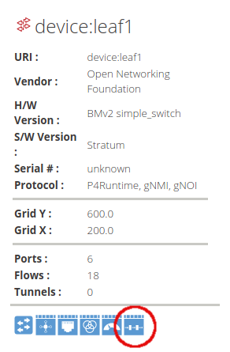
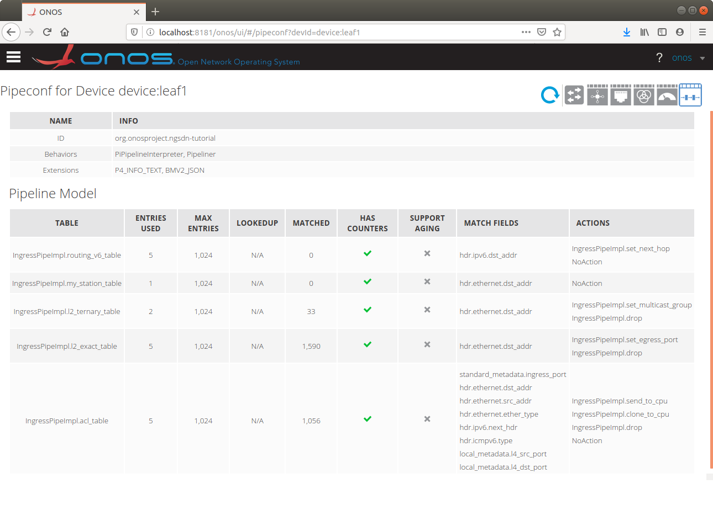

# Exercise 3: Using ONOS as the Control Plane

This exercise provides a hands-on introduction to ONOS, where you will learn how
to:

1. Start ONOS along with a set of built-in apps for basic services such as
   topology discovery
2. Load a custom ONOS app and pipeconf
3. Push a configuration file to ONOS to discover and control the
   `stratum_bmv2` switches using P4Runtime and gNMI
4. Access the ONOS CLI and UI to verify that all `stratum_bmv2` switches have
   been discovered and configured correctly.

## 1. Start ONOS

In a terminal window, type:

```
$ make restart
```

This command will restart the ONOS and Mininet containers, in case those were
running from previous exercises, clearing any previous state.

The parameters to start the ONOS container are specified in [docker
-compose.yml](docker-compose.yml). The container is configured to pass the
environment variable `ONOS_APPS`, used to define the built-in apps to load
during startup.

In our case, this variable has value:

```
ONOS_APPS=gui2,drivers.bmv2,lldpprovider,hostprovider
```

requesting ONOS to pre-load the following built-in apps:

* `gui2`: ONOS web user interface (available at <http://localhost:8181/onos/ui>)
* `drivers.bmv2`: BMv2/Stratum drivers based on P4Runtime, gNMI, and gNOI
* `lldpprovider`: LLDP-based link discovery application (used in Exercise 4)
* `hostprovider`: Host discovery application (used in Exercise 4)


Once ONOS has started, you can check its log using the `make onos-log` command.

To **verify that all required apps have been activated**, run the following
command in a new terminal window to access the ONOS CLI. Use password `rocks`
when prompted:

```
$ make onos-cli
```

If you see the following error, then ONOS is still starting; wait a minute and try again.
```
ssh_exchange_identification: Connection closed by remote host
make: *** [onos-cli] Error 255
```

When you see the Password prompt, type the default password: `rocks`. 
Then type the following command in the ONOS CLI to show the list of running apps:

```
onos> apps -a -s
```

Make sure you see the following list of apps displayed:

```
*   5 org.onosproject.protocols.grpc        2.2.2    gRPC Protocol Subsystem
*   6 org.onosproject.protocols.gnmi        2.2.2    gNMI Protocol Subsystem
*  29 org.onosproject.drivers               2.2.2    Default Drivers
*  34 org.onosproject.generaldeviceprovider 2.2.2    General Device Provider
*  35 org.onosproject.protocols.p4runtime   2.2.2    P4Runtime Protocol Subsystem
*  36 org.onosproject.p4runtime             2.2.2    P4Runtime Provider
*  37 org.onosproject.drivers.p4runtime     2.2.2    P4Runtime Drivers
*  42 org.onosproject.protocols.gnoi        2.2.2    gNOI Protocol Subsystem
*  52 org.onosproject.hostprovider          2.2.2    Host Location Provider
*  53 org.onosproject.lldpprovider          2.2.2    LLDP Link Provider
*  66 org.onosproject.drivers.gnoi          2.2.2    gNOI Drivers
*  70 org.onosproject.drivers.gnmi          2.2.2    gNMI Drivers
*  71 org.onosproject.pipelines.basic       2.2.2    Basic Pipelines
*  72 org.onosproject.drivers.stratum       2.2.2    Stratum Drivers
* 161 org.onosproject.gui2                  2.2.2    ONOS GUI2
* 181 org.onosproject.drivers.bmv2          2.2.2    BMv2 Drivers
```

There are definitely more apps than defined in `$ONOS_APPS`. That's
because each app in ONOS can define other apps as dependencies. When loading an
app, ONOS automatically resolves dependencies and loads all other required apps.

#### Disable link discovery service

Link discovery will be the focus of the next exercise. For now, this service
lacks support in the P4 program. We suggest you deactivate it for the rest of
this exercise, to avoid running into issues. Use the following ONOS
CLI command to deactivate the link discovery service.

```
onos> app deactivate lldpprovider
```

To exit the ONOS CLI, use `Ctrl-D`. This will stop the CLI process
but will not affect ONOS itself.

#### Restart ONOS in case of errors

If anything goes wrong and you need to kill ONOS, you can use command `make
restart` to restart both Mininet and ONOS.

## 2. Build app and register pipeconf

Inside the [app/](./app) directory you will find a starter implementation of an
ONOS app that includes a pipeconf. The pipeconf-related files are the following:

* [PipeconfLoader.java][PipeconfLoader.java]: A component that registers the
  pipeconf at app activation;
* [InterpreterImpl.java][InterpreterImpl.java]: An implementation of the
  `PipelineInterpreter` driver behavior;
* [PipelinerImpl.java][PipelinerImpl.java]: An implementation of the `Pipeliner`
  driver behavior;

To build the ONOS app (including the pipeconf), run the following
command in the second terminal window:

```
$ make app-build
```

This will produce a binary file `app/target/ngsdn-tutorial-1.0-SNAPSHOT.oar`
that we will use to install the application in the running ONOS instance.

Use the following command to load the app into ONOS and activate it:

```
$ make app-reload
```

After the app has been activated, you should see the following messages in the
ONOS log (`make onos-log`) signaling that the pipeconf has been registered and
the different app components have been started:

```
INFO  [PiPipeconfManager] New pipeconf registered: org.onosproject.ngsdn-tutorial (fingerprint=...)
INFO  [MainComponent] Started
```

Alternatively, you can show the list of registered pipeconfs using the ONOS CLI
(`make onos-cli`) command:

```
onos> pipeconfs
```

## 3. Push netcfg to ONOS

Now that ONOS and Mininet are running, it's time to let ONOS know how to reach
the four switches and control them. We do this by using a configuration file
located at [mininet/netcfg.json](mininet/netcfg.json), which contains
information such as:

* The gRPC address and port associated with each Stratum device;
* The ONOS driver to use for each device, `stratum-bmv2` in this case;
* The pipeconf to use for each device, `org.onosproject.ngsdn-tutorial` in this
  case, as defined in [PipeconfLoader.java][PipeconfLoader.java];
* Configuration specific to our custom app (`fabricDeviceConfig`)

This file also contains information related to the IPv6 configuration associated
with each switch interface. We will discuss this information in more details in
the next exercises.

On a terminal window, type:

```
$ make netcfg
```

This command will push the `netcfg.json` to ONOS, triggering discovery and
configuration of the 4 switches.

Check the ONOS log (`make onos-log`), you should see messages like:

```
INFO  [GrpcChannelControllerImpl] Creating new gRPC channel grpc:///mininet:50001?device_id=1...
...
INFO  [StreamClientImpl] Setting mastership on device:leaf1...
...
INFO  [PipelineConfigClientImpl] Setting pipeline config for device:leaf1 to org.onosproject.ngsdn-tutorial...
...
INFO  [GnmiDeviceStateSubscriber] Started gNMI subscription for 6 ports on device:leaf1
...
INFO  [DeviceManager] Device device:leaf1 port [leaf1-eth1](1) status changed (enabled=true)
INFO  [DeviceManager] Device device:leaf1 port [leaf1-eth2](2) status changed (enabled=true)
INFO  [DeviceManager] Device device:leaf1 port [leaf1-eth3](3) status changed (enabled=true)
INFO  [DeviceManager] Device device:leaf1 port [leaf1-eth4](4) status changed (enabled=true)
INFO  [DeviceManager] Device device:leaf1 port [leaf1-eth5](5) status changed (enabled=true)
INFO  [DeviceManager] Device device:leaf1 port [leaf1-eth6](6) status changed (enabled=true)
```

## 4. Use the ONOS CLI to verify the network configuration

Access the ONOS CLI using `make onos-cli`. Enter the following command to
verify the network config pushed before:

```
onos> netcfg
```

#### Devices

Verify that all 4 devices have been discovered and are connected:

```
onos> devices -s
id=device:leaf1, available=true, role=MASTER, type=SWITCH, driver=stratum-bmv2:org.onosproject.ngsdn-tutorial
id=device:leaf2, available=true, role=MASTER, type=SWITCH, driver=stratum-bmv2:org.onosproject.ngsdn-tutorial
id=device:spine1, available=true, role=MASTER, type=SWITCH, driver=stratum-bmv2:org.onosproject.ngsdn-tutorial
id=device:spine2, available=true, role=MASTER, type=SWITCH, driver=stratum-bmv2:org.onosproject.ngsdn-tutorial
```

Make sure you see `available=true` for all devices. That means ONOS has a gRPC
channel open to the device and the pipeline configuration has been pushed.


#### Ports

Check port information, obtained by ONOS by performing a gNMI Get RPC for the
OpenConfig Interfaces model:

```
onos> ports -s device:spine1
id=device:spine1, available=true, role=MASTER, type=SWITCH, driver=stratum-bmv2:org.onosproject.ngsdn-tutorial
  port=[spine1-eth1](1), state=enabled, type=copper, speed=10000 , ...
  port=[spine1-eth2](2), state=enabled, type=copper, speed=10000 , ...
```

Check port statistics, also obtained by querying the OpenConfig Interfaces model
via gNMI:

```
onos> portstats device:spine1
deviceId=device:spine1
   port=[spine1-eth1](1), pktRx=114, pktTx=114, bytesRx=14022, bytesTx=14136, pktRxDrp=0, pktTxDrp=0, Dur=173
   port=[spine1-eth2](2), pktRx=114, pktTx=114, bytesRx=14022, bytesTx=14136, pktRxDrp=0, pktTxDrp=0, Dur=173

```

#### Flow rules and groups

Check the ONOS flow rules. You should see three flow rules for each device. For
example, to show all flow rules installed so far on device `leaf1`:

```
onos> flows -s any device:leaf1
deviceId=device:leaf1, flowRuleCount=3
    ADDED, bytes=0, packets=0, table=IngressPipeImpl.acl_table, priority=40000, selector=[ETH_TYPE:arp], treatment=[immediate=[IngressPipeImpl.clone_to_cpu()]]
    ADDED, bytes=0, packets=0, table=IngressPipeImpl.acl_table, priority=40000, selector=[ETH_TYPE:ipv6, IP_PROTO:58, ICMPV6_TYPE:136], treatment=[immediate=[IngressPipeImpl.clone_to_cpu()]]
    ADDED, bytes=0, packets=0, table=IngressPipeImpl.acl_table, priority=40000, selector=[ETH_TYPE:ipv6, IP_PROTO:58, ICMPV6_TYPE:135], treatment=[immediate=[IngressPipeImpl.clone_to_cpu()]]

```

This list include flow rules installed by the ONOS built-in services such as
`hostprovider`. We'll talk more about these services in the next exercise.

To show all groups installed so far, you can use the `groups` command. For
example to show groups on `leaf1`:
```
onos> groups any device:leaf1
deviceId=device:leaf1, groupCount=1
   id=0x63, state=ADDED, type=CLONE, bytes=0, packets=0, appId=org.onosproject.core, referenceCount=0
       id=0x63, bucket=1, bytes=0, packets=0, weight=-1, actions=[OUTPUT:CONTROLLER]
```

"Group" is an ONOS northbound abstraction that is mapped internally to different
types of P4Runtime entities. In this case, you should see 1 group of type
`CLONE`, internally mapped to a P4Runtime `CloneSessionEntry`, here used to
clone packets to the controller via packet-in. We'll talk more about controller
packet-in/out in the next session.

## 5. Visualize the topology on the ONOS web UI

Using the ONF Cloud Tutorial Portal, access the ONOS UI.
If you are running the VM on your laptop, open up a browser (e.g. Firefox) to
<http://127.0.0.1:8181/onos/ui>.

When asked, use the username `onos` and password `rocks`.

You should see 4 devices in the topology view, corresponding to the 4 switches
of our 2x2 fabric. Press `L` to show device labels. Because link discovery is
not enabled, the ONOS UI will not show any links between the devices.

While here, feel free to interact with and discover the ONOS UI. For more
information on how to use the ONOS web UI please refer to this guide:

<https://wiki.onosproject.org/x/OYMg>

There is a way to show the pipeconf details for a given device, can you find it?

#### Pipeconf UI

In the ONOS topology view click on one of the switches (e.g `device:leaf1`)
and the Device Details panel appears. In that panel click on the Pipeconf icon
(the last one), to open the Pipeconf view for that device.



Here you will find info on the pipeconf currently used by the specific device,
including details of the P4 tables.



Clicking the table row brings up the details panel, showing details of the match
fields, actions, action parameter bit widths, etc.


## Congratulations!

You have completed the third exercise! If you're feeling ambitious,
you can do the extra credit steps below.

### Extra Credit: Inspect stratum_bmv2 internal state

You can use the P4Runtime shell to dump all table entries currently
installed on the switch by ONOS. In a separate terminal window, start a
P4Runtime shell for leaf1:

```
$ util/p4rt-sh --grpc-addr localhost:50001 --election-id 0,1
```

On the shell prompt, type the following command to dump all entries from the ACL
table:

```
P4Runtime sh >>> for te in table_entry["IngressPipeImpl.acl_table"].read():
            ...:     print(te)
            ...:
```

You should see exactly three entries, each one corresponding to a flow rule
in ONOS. For example, the flow rule matching on NDP NS packets should look
like this in the P4runtime shell:

```
table_id: 33557865 ("IngressPipeImpl.acl_table")
match {
  field_id: 4 ("hdr.ethernet.ether_type")
  ternary {
    value: "\\x86\\xdd"
    mask: "\\xff\\xff"
  }
}
match {
  field_id: 5 ("hdr.ipv6.next_hdr")
  ternary {
    value: "\\x3a"
    mask: "\\xff"
  }
}
match {
  field_id: 6 ("hdr.icmpv6.type")
  ternary {
    value: "\\x87"
    mask: "\\xff"
  }
}
action {
  action {
    action_id: 16782152 ("IngressPipeImpl.clone_to_cpu")
  }
}
priority: 40001
```

### Extra Credit: Show ONOS gRPC log

ONOS provides a debugging feature that dumps all gRPC messages
exchanged with a device to a file. To enable this feature, type the
following command in the ONOS CLI (`make onos-cli`):

```
onos> cfg set org.onosproject.grpc.ctl.GrpcChannelControllerImpl enableMessageLog true
```

Check the content of directory `tmp/onos` in the `ngsdn-tutorial` root. You
should see many files, some of which starting with name `grpc___mininet_`. You
should see four such files, one file per device, named after the gRPC
port used to establish the gRPC chanel.

Check content of one of these files, you should see a dump of the gRPC messages
in Protobuf Text format for messages like:

* P4Runtime `PacketIn` and `PacketOut`;
* P4Runtime Read RPCs used to periodically dump table entries and read counters;
* gNMI Get RPCs to read port counters.

Remember to disable the gRPC message logging in ONOS when you're done, to avoid
affecting performances:

```
onos> cfg set org.onosproject.grpc.ctl.GrpcChannelControllerImpl enableMessageLog false
```

[PipeconfLoader.java]: app/src/main/java/org/onosproject/ngsdn/tutorial/pipeconf/PipeconfLoader.java
[InterpreterImpl.java]: app/src/main/java/org/onosproject/ngsdn/tutorial/pipeconf/InterpreterImpl.java
[PipelinerImpl.java]: app/src/main/java/org/onosproject/ngsdn/tutorial/pipeconf/PipelinerImpl.java
