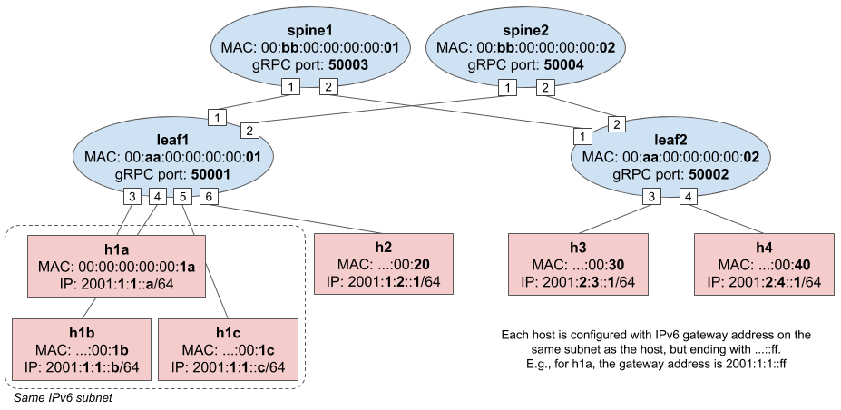

# Exercise 4 - Modify code to enable IPv6 routing

In this exercise you will be asked to apply changes to the P4 code as well as
the ONOS app to enable IPv6 routing for hosts on different subnets.

Indeed, our fabric control plane (i.e., the ONOS app) assumes that hosts of a
given subnet are all connected to the same leaf, and two interfaces of two
different leaves cannot be configured with the same IPv6 subnet. In other words,
L2 bridging is allowed only for hosts connected to the same leaf. To be able to
ping different hosts attached to different leaves, we need to support IPv6
routing in the data plane.

The Mininet script [topo.py](mininet/topo.py) used in this tutorial defines 4
subnets:

* `2001:1:1::/64` with 3 hosts connected to `leaf1` (`h1a`, `h1b`, and `h1c`)
* `2001:1:2::/64` with 1 hosts connected to `leaf1` (`h2`)
* `2001:2:3::/64` with 1 hosts connected to `leaf2` (`h3`)
* `2001:2:4::/64` with 1 hosts connected to `leaf2` (`h4`)



The same IPv6 prefixes are defined in the [netcfg.json](mininet/netcfg.json)
file and are used to provide an IPv6 address to the switch interfaces, i.e. the
gateway address from the host perspective. The goal of our ONOS app is to
program the switch such that it behaves as a traditional IPv6 router.

Unfortunately, the starter code we have provided to you has a broken
implementation of IPv6 routing. Your task is to fix it.

## Why routing is not working?

To find out why, let's use the Mininet CLI (`make mn-cli`). ONOS and Mininet
should be running from the previous exercise. If this is not the case, go back
to step 2 of Exercise 3.

Let's start by pinging two hosts in the same subnet, for example `h1a` and
`h1b`:

```
mininet> h1a ping h1b
PING 2001:1:1::b(2001:1:1::b) 56 data bytes
64 bytes from 2001:1:1::b: icmp_seq=1 ttl=64 time=1068 ms
64 bytes from 2001:1:1::b: icmp_seq=2 ttl=64 time=5.38 ms
64 bytes from 2001:1:1::b: icmp_seq=3 ttl=64 time=1.75 ms
...
```

Ping for hosts in the same subnet works. Let's try pinging hosts on different
subnets, such as `h2` (with IPv6 address `2001:1:2::1/64`, where the network
part is `2001:1:2::`) and `h1a` (`2001:1:1::a/64` on network `2001:1:1::`):

```
mininet> h2 ping h1a
PING 2001:1:1::a(2001:1:1::a) 56 data bytes
From 2001:1:2::1 icmp_seq=1 Destination unreachable: Address unreachable
From 2001:1:2::1 icmp_seq=2 Destination unreachable: Address unreachable
From 2001:1:2::1 icmp_seq=3 Destination unreachable: Address unreachable
...
```

Ping doesn't work. To find out why and debug the issue, let's leave the ping
running for now.

### Check flow rules and groups

The first thing to do is to check that `leaf1` (where both hosts are attached)
has all the required flow rules and groups to route packets between `h2` and
`h1a`. We should see relevant entries in the `routing_v6_table`.

Open up the ONOS CLI (`make onos-cli`) and dump entries for the
`routing_v6_table`:
 
```
onos> flows -s any device:leaf1 | grep routing_v6_table
```

Verify that the following entries are present:

```
ADDED, bytes=0, packets=0, table=IngressPipeImpl.routing_v6_table, priority=10, selector=[hdr.ipv6.dst_addr=0x2001000100010000000000000000000a/128], treatment=[immediate=[GROUP:0x1a]]
...
ADDED, bytes=0, packets=0, table=IngressPipeImpl.routing_v6_table, priority=10, selector=[hdr.ipv6.dst_addr=0x20010001000200000000000000000001/128], treatment=[immediate=[GROUP:0x20]]
```

These entries are needed to route packets with destination IPv6 address the one
of `h2` (the first entry) and `h1a` (the second one). Both entries have byte and
packet counters with value 0, which is suspicious, as the `routing_v6_table` is
defined to have counters in the P4 program, and ONOS periodically reads those.
It looks like no packets are matching these entries. What could be the problem?

### Dump packets at the interface of h2

While the ping between `h2` and `h1a` is running, let's use `tcpdump` to dump
all packets sent and received by `h2`.

On a new terminal window, type the following command:

```
util/mn-cmd h2 tcpdump -i h2-eth0 -n
```

The `mn-cmd` utility can be used to run an arbitrary command inside the network
namespace of a Mininet host. Here we use it to start `tcpdump` on `h2`,
specifying to dump packets off interface `h2-eth0` (the only one in `h2`). The
`-n` is used to avoid DNS lookups on the packets' addresses.

The dump shown on screen should reveal the reason why routing is not working.

```
...
21:05:13.653869 IP6 2001:1:2::1 > ff02::1:ff00:ff: ICMP6, neighbor solicitation, who has 2001:1:2::ff, length 32
21:05:14.678054 IP6 2001:1:2::1 > ff02::1:ff00:ff: ICMP6, neighbor solicitation, who has 2001:1:2::ff, length 32
21:05:15.701769 IP6 2001:1:2::1 > ff02::1:ff00:ff: ICMP6, neighbor solicitation, who has 2001:1:2::ff, length 32
...
```

`h2` is trying to resolve the MAC address of `2001:1:2::ff`, but no one is
answering. `2001:1:2::ff` is the IPv6 gateway configured in `h2`. To ping `h1a`,
`h2` needs to send packets to its gateway, `2001:1:2::ff` in this case, but it
cannot obtain the corresponding MAC address.

If you look at the [netcfg.json](mininet/netcfg.json) file, you will notice that
`2001:1:2::ff` is the IPv6 address associated to port `6` of `leaf1`.

We said before that our fabric should behave as a traditional IPv6 router, and
so it should be able to reply to Neighbor Solicitation (NS) packets sent by the
attached hosts, generating a Neighbor Advertisement (NA) with the switch MAC
address (`myStationMac`). Unfortunately, the implementation of NDP handling for
the switch interface IPv6 addresses is incomplete. You will need to modify the
P4 program as well as the ONOS app to make it work.

### Implementing NDP handling for the switch interface IPv6 addresses

We already provide ways to handle NDP NS and NA exchanged by hosts connected to
the same subnet (see `l2_ternary_table`). However, for hosts, the Linux
networking stack takes care of generating a NDP NA reply. For the switches in
our fabric, there's no Linux networking stack associated to it.

There are multiple solutions to this problem:

* we can configure hosts with static NDP entries, removing the need for the
  switch to reply to NDP NS packets;
* we can intercept NDP NS via packet-in, generate a corresponding NDP NA
  reply in ONOS, and send it back via packet-out; or
* we can instruct the switch to genrate NDP NA replies using P4. That is, we can
  write P4 code that takes care of replying to NDP requests without any
  intervention from the control plane.

We choose to implement the last option to show an interesting use case of P4.

The idea is simple, NDP NA packets have the same header structure as NDP NS
ones. They are both ICMPv6 packets with different header field values, such as
different ICMPv6 type, different Ethernet addresses etc. A switch that knows the
MAC address of a given IPv6 target address found in an NDP NS request, can
transform the same packet to an NDP NA reply by modifying some of its fields.

## Exercise steps

In the following you will be asked to:

1. modify the P4 program to enable in-switch NDP NA generation;
2. run PTF tests to make sure your changes work as expected and to avoid
   regressions;
3. modify the ONOS app to control the NDP generation feature of the P4 program;
4. test connectivity on Mininet.

### 1. Modify P4 program

In the ingress pipeline implementation in [p4src/main.p4](p4src/main.p4), we
already provide an action named `ndp_ns_to_na` to transform an NDP NS packet
into an NDP NA one. Your task is to implement a table that uses such action.

This table should define a mapping between the interface IPv6 addresses
provided in [netcfg.json](mininet/netcfg.json) and the `myStationMac` associated
to each switch (also defined in netcfg.json). When an NDP
NS packet is received, asking to resolve one of such IPv6 addresses, the
`ndp_ns_to_na` action should be invoked with the given `myStationMac` as
parameter. The ONOS app will be responsible of inserting entries in this table
according to the content of netcfg.json.

1. Open `p4src/main.p4`;
2. Look for the implementation of the ingress pipeline (`control IngressPipeImpl`);
3. Modify the code where requested (look for `TODO EXERCISE 4`);
4. Compile the modified P4 program using the `make p4-build` command. Make sure
   to address any compiler errors before continuing.

### 2. Run PTF tests

Before proceeding, let's make sure the P4 changes work as expected by running
some PTF tests. We provide a test case for NDP generation, as well as others for
the basic capabilities such as packet-in/out, bridging, routing, etc. Running
PTF tests will provide some guarantees that your changes work as expected,
without breaking other parts of the program.

Before running the test, you need to apply a few simple changes to the test
case implementation.

Open file `ptf/tests/ndp.py` and modify wherever requested (look for `TODO
EXERCISE 4`). This test file defines only one test case that does the following:

1. insert one entry in the table you just created;
2. send an NDP NS packet to the switch;
3. verifies that the switch sends back an NDP NA properly populated.
 
You will need to modify the test case by filling in the name of the table you
just created.

To run just the NDP test case:

    make p4-test TEST=ndp

To make sure the new changes are not breaking other features, you should run
all tests with the command:

    make p4-test

If all tests succeed, congratulations! You can move to the next step. Otherwise...

**How to debug failing tests?**

When running PTF tests, multiple files are produced that you can use to spot
bugs:

* `ptf/stratum_bmv2.log`: BMv2 log with trace level (showing tables matched and other
  info for each packet)
* `ptf/ptf.pcap`: PCAP file with all packets sent and received during tests
  (you might need to install Wireshark for easier visualization)
* `ptf/ptf.log`: PTF log of all packet operations (sent and received)

### 3. Modify ONOS app

The app starter code already provides a component that is responsible of
controlling the NDP generation feature in the P4 program. This component works
by listening for device events. When ONOS connects to a new switch, it looks at
the network config (netcfg.json) to get all interface IPv6 addresses and the
`myStationMac`, it then uses this information to populate the table that you
just created.

Before using this component, you will need to apply few modifications to make it
work with your P4 program. For example, you need to provide the name of the
P4 table you just created.

1. Open file:
   `app/src/main/java/org/onosproject/ngsdn/tutorial/NdpReplyComponent.java`

2. Modify wherever requested (look for `TODO EXERCISE 4`)

3. Build ONOS app (including the pipeconf) with the command `make app-build`.

### 4. Build and reload the app

Use the following command to reload your app while ONOS is running:

```
$ make app-reload
```

#### Reloading the app after the first time

When building the app, the modified P4 compiler outputs (`bmv2.json` and
`p4info.txt`) will be packaged together along with the Java classes. If another
instance of the same app is running, the command `make app-reload` will first
deactivate the running instance and load the new one.

To apply changes to the app implementation, feel free to use `make app-build
app-reload` as many times as you want. The app already includes logic to clean
up any table entries and other forwarding state from ONOS at each reload.

#### Verify ONOS log

After reloading the app, you should see messages signaling that a new pipeline
configuration has been set and the `NdpReplyComponent` has been activated:

```
INFO  [PiPipeconfManager] Unregistered pipeconf: org.onosproject.ngsdn-tutorial (fingerprint=...)
INFO  [PipeconfLoader] Found 1 outdated drivers for pipeconf 'org.onosproject.ngsdn-tutorial', removing...
INFO  [PiPipeconfManager] New pipeconf registered: org.onosproject.ngsdn-tutorial (fingerprint=...)
INFO  [PipelineConfigClientImpl] Setting pipeline config for device:leaf1 to org.onosproject.ngsdn-tutorial...
...
INFO  [MainComponent] Waiting to remove flows and groups from previous execution of org.onosproject.ngsdn-tutorial..
...
INFO  [MainComponent] Started
INFO  [NdpReplyComponent] Started
...
INFO  [NdpReplyComponent] *** NDP REPLY - Starting Initial set up for device:leaf1...
INFO  [NdpReplyComponent] Adding rules to device:leaf1 to generate NDP NA for 4 IPv6 interfaces...
INFO  [NdpReplyComponent] *** NDP REPLY - Starting Initial set up for device:spine1...
INFO  [NdpReplyComponent] device:spine1 does not have any IPv6 interface configured
INFO  [NdpReplyComponent] *** NDP REPLY - Starting Initial set up for device:spine2...
INFO  [NdpReplyComponent] device:spine2 does not have any IPv6 interface configured
INFO  [NdpReplyComponent] *** NDP REPLY - Starting Initial set up for device:leaf2...
INFO  [NdpReplyComponent] Adding rules to device:leaf2 to generate NDP NA for 2 IPv6 interfaces...
...
```

#### Understanding ONOS error logs

Before trying your solution in Mininet, it's worth looking at the ONOS log for
possible errors. There are mainly 2 types of errors that you might see when
reloading the app:

1. Write errors, such as removing a nonexistent entity or inserting one that
   already exists:

    ```
    WARN  [WriteResponseImpl] Unable to DELETE PRE entry on device...: NOT_FOUND Multicast group does not exist ...
    WARN  [WriteResponseImpl] Unable to INSERT table entry on device...: ALREADY_EXIST Match entry exists, use MODIFY if you wish to change action ...
    ```
    
    These are usually transient errors and **you should not worry about them**.
    They describe a temporary inconsistency of the ONOS-internal device state,
    which should be soon recovered by a periodic reconciliation mechanism.
    The ONOS core periodically polls the device state to make sure its
    internal representation is accurate, while writing any pending modifications
    to the device, solving these errors.
    
    Otherwise, if you see them appearing periodically (every 3-4 seconds), it
    means the reconciliation process is not working and something else is wrong.
    Try re-loading the app (`make app-reload`); if that doesn't resolve the
    warnings, check with the instructors.
    
2. Translation errors, signifying that ONOS is not able to translate the flow
   rules (or groups) generated by apps, to a representation that is compatible
   with your P4Info. For example:

    ```
    WARN  [P4RuntimeFlowRuleProgrammable] Unable to translate flow rule for pipeconf 'org.onosproject.ngsdn-tutorial':...
    ```

    **Read carefully the error message and make changes to the app as needed.**
    Chances are that you are using a table, match field, or action name that
    does not exist in your P4Info. Check your P4Info file, modify, and reload the
    app (`make app-build app-reload`).

### 5. Test IPv6 routing on Mininet

#### Verify ping

If you left the ping between `h2` and `h1a` running, check that terminal window,
it should work now!

To verify that ping works also for hosts attached to different leaves, let's
start a new ping between `h2` and `h3` with the following commands, in order:

```
mininet> h2 ping h3
mininet> h3 ping h2
PING 2001:1:2::1(2001:1:2::1) 56 data bytes
64 bytes from 2001:1:2::1: icmp_seq=2 ttl=61 time=2.39 ms
64 bytes from 2001:1:2::1: icmp_seq=3 ttl=61 time=2.29 ms
64 bytes from 2001:1:2::1: icmp_seq=4 ttl=61 time=2.71 ms
...
```

Ping between `h3` and `h2` should work.

**Note:** we need to start the ping first from `h2` and then from `h3` to let 
ONOS discover the location of both hosts before ping packets can be forwarded.
That's because the current implementation requires hosts to generate NDP NS
packets to be discovered by ONOS. To avoid having to manually generate NDP NS
messages, a possible solution could be:

* Configure IPv6 hosts in Mininet to periodically and automatically generate a
  different type of NDP messages, named Router Solicitation (RS).
  
* Insert a flow rule in the ACL table to clone NDP RS packets to the CPU. This
  would require matching on a different value of ICMPv6 code other than NDP NA
  and NS.
  
* Modify the `hostprovider` built-in app implementation to learn host location
  from NDP RS messages (it currently uses only NDP NA and NS).

#### Verify P4-based NDP NA generation

To verify that the P4-based generation of NDP NA replies by the switch is
working, you can check the neighbor table of `h2` or `h3`, it should show
something similar to this:

```
mininet> h2 ip -6 n
2001:2:3::ff dev h2-eth0 lladdr 00:aa:00:00:00:02 router REACHABLE
```

Where `2001:2:3::ff` is the IPv6 gateway address defined in `netcfg.json` and
`topo.py`, and `00:aa:00:00:00:02` is the `myStationMac` defined for `leaf2` in 
`netcfg.json`.

### 6. Visualize ECMP using the ONOS web UI

To verify that ECMP is working, let's start multiple parallel traffic flows from
`h2` to `h3` using iperf. In the Mininet command prompt, type:

```
mininet> h2 iperf -c h3 -u -V -P5 -b1M -t600 -i1
```

This commands will start an iperf client on `h2`, sending UDP packets (`-u`)
over IPv6 (`-V`) to `h3` (`-c`). In doing this, we generate 5 distinct flows
(`-P5`), each one capped at 1Mbit/s (`-b1M`), running for 10 minutes (`-t600`)
and reporting stats every 1 second (`-i1`).

Since we are generating UDP traffic, there's no need to start an iperf server
on `h3`.

To visualize traffic, open a browser from within the tutorial VM (e.g. Firefox)
to <http://127.0.0.1:8181/onos/ui>. When asked, use the username `onos` and
password `rocks`. On the same page where the ONOS topology view is shown:

* Press `H` on your keyboard to show hosts;
* Press `L` to show device labels;
* Press `A` multiple times until you see port/link stats, in either 
  packets/seconds (pps) or bits/seconds.

ECMP should be working as expected, as such you should see traffic being
forwarded to both spines as in the screenshot below:


### Congratulations!

You have completed the last exercise! Now your fabric is capable of forwarding
IPv6 traffic between any host.
