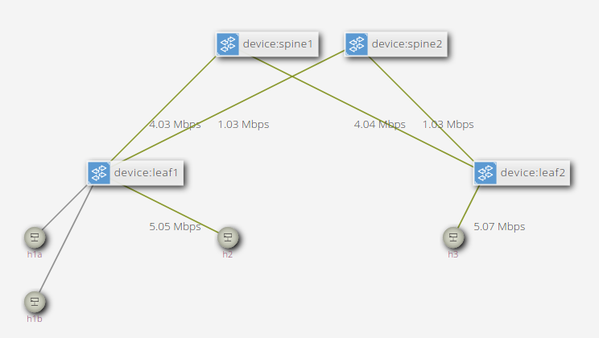

# Exercise 5: IPv6 Routing

In this exercise, you will be modifying the P4 program and ONOS app to add
support for IPv6-based (L3) routing between all hosts connected to the fabric,
with support for ECMP to balance traffic flows across multiple spines.

## Background

### Requirements

At this stage, we want our fabric to behave like a standard IP fabric, with
switches functioning as routers. As such, the following requirements should be
satisfied:

* Leaf interfaces should be assigned with an IPv6 address (the gateway address)
  and a MAC address that we will call `myStationMac`;
* Leaf switches should be able to handle NDP Neighbor Solicitation (NS)
  messages -- sent by hosts to resolve the MAC address associated with the
  switch interface/gateway IPv6 addresses, by replying with NDP Neighbor
  Advertisements (NA) notifying their `myStationMac` address;
* Packets received with Ethernet destination `myStationMac` should be processed
  through the routing tables (traffic that is not dropped can then be
  processed through the bridging tables);
* When routing, the P4 program should look at the IPv6 destination address. If a
  matching entry is found, the packet should be forwarded to a given next hop
  and the packet's Ethernet addresses should be modified accordingly (source set
  to `myStationMac` and destination to the next hop one);
* When routing packets to a different leaf across the spines, leaf switches
  should be able to use ECMP to distribute traffic.

### Configuration

The [netcfg.json](mininet/netcfg.json) file includes a special configuration for
each device named `fabricDeviceConfig`, this block defines 3 values:

 * `myStationMac`: MAC address associated with each device, i.e., the router MAC
   address;
 * `mySid`: the SRv6 segment ID of the device, used in the next exercise.
 * `isSpine`: a boolean flag, indicating whether the device should be considered
   as a spine switch.

Moreover, the [netcfg.json](mininet/netcfg.json) file also includes a list of
interfaces with an IPv6 prefix assigned to them (look under the `ports` section
of the file). The same IPv6 addresses are used in the Mininet topology script
[topo-v6.py](mininet/topo-v6.py).

### Try pinging hosts in different subnets

Similarly to the previous exercise, let's start by using Mininet to verify that
pinging between hosts on different subnets does NOT work. It will be your task
to make it work.

On the Mininet CLI:

```
mininet> h2 ping h3
PING 2001:2:3::1(2001:2:3::1) 56 data bytes
From 2001:1:2::1 icmp_seq=1 Destination unreachable: Address unreachable
From 2001:1:2::1 icmp_seq=2 Destination unreachable: Address unreachable
From 2001:1:2::1 icmp_seq=3 Destination unreachable: Address unreachable
...
```

If you check the ONOS log, you will notice that `h2` has been discovered:

```
INFO  [L2BridgingComponent] HOST_ADDED event! host=00:00:00:00:00:20/None, deviceId=device:leaf1, port=6
INFO  [L2BridgingComponent] Adding L2 unicast rule on device:leaf1 for host 00:00:00:00:00:20/None (port 6)...
```

That's because `h2` sends NDP NS messages to resolve the MAC address of its
gateway (`2001:1:2::ff` as configured in [topo-v6.py](mininet/topo-v6.py)).

We can check the IPv6 neighbor table for `h2` to see that the resolution
has failed:

```
mininet> h2 ip -6 n
2001:1:2::ff dev h2-eth0  FAILED
```

## 1. Modify P4 program

The first step will be to add new tables to `main.p4`.

#### P4-based generation of NDP messages

We already provide ways to handle NDP NS and NA exchanged by hosts connected to
the same subnet (see `l2_ternary_table`). However, for hosts, the Linux
networking stack takes care of generating a NDP NA reply. For the switches in
our fabric, there's no traditional networking stack associated to it.

There are multiple solutions to this problem:

* we can configure hosts with static NDP entries, removing the need for the
  switch to reply to NDP NS packets;
* we can intercept NDP NS via packet-in, generate a corresponding NDP NA
  reply in ONOS, and send it back via packet-out; or
* we can instruct the switch to generate NDP NA replies using P4
  (i.e., we write P4 code that takes care of replying to NDP requests without any
  intervention from the control plane).

**Note:** The rest of the exercise assumes you will decide to implement the last
option. You can decide to go with a different one, but you should keep in mind
that there will be less starter code for you to re-use.

The idea is simple: NDP NA packets have the same header structure as NDP NS
ones. They are both ICMPv6 packets with different header field values, such as
different ICMPv6 type, different Ethernet addresses etc. A switch that knows the
MAC address of a given IPv6 target address found in an NDP NS request, can
transform the same packet to an NDP NA reply by modifying some of its fields.

To implement P4-based generation of NDP NA messages, look in
[p4src/snippets.p4](p4src/snippets.p4), we already provide an action named
`ndp_ns_to_na` to transform an NDP NS packet into an NDP NA one. Your task is to
implement a table that uses such action.

This table should define a mapping between the interface IPv6 addresses provided
in [netcfg.json](mininet/netcfg.json) and the `myStationMac` associated to each
switch (also defined in netcfg.json). When an NDP NS packet is received, asking
to resolve one of such IPv6 addresses, the `ndp_ns_to_na` action should be
invoked with the given `myStationMac` as parameter. The ONOS app will be
responsible of inserting entries in this table according to the content of
netcfg.json.

The ONOS app already provides a component
[NdpReplyComponent.java](app/src/main/java/org/onosproject/ngsdn/tutorial/NdpReplyComponent.java)
responsible of inserting entries in this table.

The component is currently disabled. You will need to enable and modify it in
the next steps, but for now, let's focus on the P4 program.

#### LPM IPv6 routing table

The main table for this exercise will be an L3 table that matches on the
destination IPv6 address. You should create a table that performs longest
prefix match (LPM) on the destination address and performs the required packet
transformations:

1. Replace the source Ethernet address with the destination one, expected to be
   `myStationMac` (see next section on "My Station" table).
2. Set the destination Ethernet to the next hop's address (passed as an action
   argument).
3. Decrement the IPv6 `hop_limit`.

This L3 table and action should provide a mapping between a given IPv6 prefix
and a next hop MAC address. In our solution (and hence in the PTF starter code
and ONOS app), we re-use the L2 table defined in Exercise 2 to provide a mapping
between the next hop MAC address and an output port. If you want to apply the
same solution, make sure to call the L3 table before the L2 one in the `apply`
block.

Moreover, we will want to drop the packet when the IPv6 hop limit reaches 0.
This can be accomplished by inserting logic in the `apply` block that inspects
the field after applying your L3 table.

At this point, your pipeline should properly match, transform, and forward IPv6
packets.

**Note:** For simplicity, we are using a global routing table. If you would like
to segment your routing table in virtual ones (i.e. using a VRF ID), you can
tackle this as extra credit.

#### "My Station" table

You may realize that at this point the switch will perform IPv6 routing
indiscriminately, which is technically incorrect. The switch should only route
Ethernet frames that are destined for the router's Ethernet address
(`myStationMac`).

To address this issue, you will need to create a table that matches the
destination Ethernet address and marks the packet for routing if there is a
match. We call this the "My Station" table.

You are free to use a specific action or metadata to carry this information, or
for simplicity, you can use `NoAction` and check for a hit in this table in your
`apply` block. Remember to update your `apply` block after creating this table.

#### Adding support for ECMP with action selectors

The last modification you will make to the pipeline is to add an
`action_selector` that hashes traffic between the different possible next
hops. In our leaf-spine topology, we have an equal-cost path for each spine for
every leaf pair, and we want to be able to take advantage of that.

We have already defined the P4 `ecmp_selector` in
[p4src/snippets.p4](p4src/snippets.p4), but you will need to add the selector to
your L3 table. You will also need to add the selector fields as match keys.

For IPv6 traffic, you will need to include the source and destination IPv6
addresses as well as the IPv6 flow label as part of the ECMP hash, but you are
free to include other parts of the packet header if you would like. For example,
you could include the rest of the 5-tuple (i.e. L4 proto and ports); the L4
ports are parsed into `local_metadata` if would like to use them. For more
details on the required fields for hashing IPv6 traffic, see RFC6438.

You can compile the program using `make p4-build`.

Make sure to address any compiler errors before continuing.

At this point, our P4 pipeline should be ready for testing.

## 2. Run PTF tests

Tests for the IPv6 routing behavior are located in `ptf/tests/routing.py`. Open
that file up and modify wherever requested (look for `TODO EXERCISE 5`).

To run all the tests for this exercise:

    make p4-test TEST=routing

This command will run all tests in the `routing` group (i.e. the content of
`ptf/tests/routing.py`). To run a specific test case you can use:

    make p4-test TEST=<PYTHON MODULE>.<TEST CLASS NAME>

For example:

    make p4-test TEST=routing.NdpReplyGenTest


#### Check for regressions

To make sure the new changes are not breaking other features, run the
tests of the previous exercises as well.

    make p4-test TEST=packetio
    make p4-test TEST=bridging
    make p4-test TEST=routing

If all tests succeed, congratulations! You can move to the next step.

## 3. Modify ONOS app

The last part of the exercise is to update the starter code for the routing
components of our ONOS app, located here:

* `app/src/main/java/org/onosproject/ngsdn/tutorial/Ipv6RoutingComponent.java`
* `app/src/main/java/org/onosproject/ngsdn/tutorial/NdpReplyComponent.java`

Open those files and modify wherever requested (look for `TODO EXERCISE 5`).

#### Ipv6RoutingComponent.java

The starter code already provides an implementation for event listeners and the
routing policy (i.e., methods triggered as a consequence of topology
events), for example to compute ECMP groups based on the available
links between leaves and the spine.

You are asked to modify the implementation of four methods.

* `setUpMyStationTable()`: to insert flow rules for the "My Station" table;

* `createNextHopGroup()`: responsible of creating the ONOS equivalent of a
  P4Runtime action profile group for the ECMP selector of the routing table;

* `createRoutingRule()`: to create a flow rule for the IPv6 routing table;

* `createL2NextHopRule()`: to create flow rules mapping next hop MAC addresses
  (used in the ECMP groups) to output ports. You can find a similar method in
  the `L2BridgingComponent` (see `learnHost()` method). This one is called to
  create L2 rules between switches, e.g. to forward packets between leaves and
  spines. There's no need to handle L2 rules for hosts since those are inserted
  by the `L2BridgingComponent`.

#### NdpReplyComponent.java

This component listens to device events. Each time a new device is added in
ONOS, it uses the content of `netcfg.json` to populate the NDP reply table.

You are asked to modify the implementation of method `buildNdpReplyFlowRule()`,
to insert the name of the table and action to generate NDP replies.

#### Enable the routing components

Once you are confident your solution to the previous step works, before
building and reloading the app, remember to enable the routing-related
components by setting the `enabled` flag to `true` at the top of the class
definition.

For IPv6 routing to work, you should enable the following components:

* `Ipv6RoutingComponent.java`
* `NdpReplyComponent.java`

#### Build and reload the app

Use the following command to build and reload your app while ONOS is running:

```
$ make app-build app-reload
```

When building the app, the modified P4 compiler outputs (`bmv2.json` and
`p4info.txt`) will be packaged together along with the Java classes. After
reloading the app, you should see messages in the ONOS log signaling that a new
pipeline configuration has been set and the `Ipv6RoutingComponent` and
`NdpReplyComponent` have been activated. Also check the log for potentially
harmful messages (`make onos-log`). If needed, take a look at section **Appendix
A: Understanding ONOS error logs** at the end of this exercise.

## 4. Test IPv6 routing on Mininet

#### Verify ping

Type the following commands in the Mininet CLI, in order:

```
mininet> h2 ping h3
mininet> h3 ping h2
PING 2001:1:2::1(2001:1:2::1) 56 data bytes
64 bytes from 2001:1:2::1: icmp_seq=2 ttl=61 time=2.39 ms
64 bytes from 2001:1:2::1: icmp_seq=3 ttl=61 time=2.29 ms
64 bytes from 2001:1:2::1: icmp_seq=4 ttl=61 time=2.71 ms
...
```

Pinging between `h3` and `h2` should work now. If ping does NOT work,
check section **Appendix B: Troubleshooting** at the end of this exercise.

The ONOS log should show messages such as:

```
INFO  [Ipv6RoutingComponent] HOST_ADDED event! host=00:00:00:00:00:20/None, deviceId=device:leaf1, port=6
INFO  [Ipv6RoutingComponent] Adding routes on device:leaf1 for host 00:00:00:00:00:20/None [[2001:1:2::1]]
...
INFO  [Ipv6RoutingComponent] HOST_ADDED event! host=00:00:00:00:00:30/None, deviceId=device:leaf2, port=3
INFO  [Ipv6RoutingComponent] Adding routes on device:leaf2 for host 00:00:00:00:00:30/None [[2001:2:3::1]]
...
```

If you don't see messages about the discovery of `h2` (`00:00:00:00:00:20`)
it's because ONOS has already discovered that host when you tried to ping at
the beginning of the exercise.

**Note:** we need to start the ping first from `h2` and then from `h3` to let
ONOS discover the location of both hosts before ping packets can be forwarded.
That's because the current implementation requires hosts to generate NDP NS
packets to be discovered by ONOS. To avoid having to manually generate NDP NS
messages, a possible solution could be:

* Configure IPv6 hosts in Mininet to periodically and automatically generate a
  different type of NDP messages, named Router Solicitation (RS).

* Insert a flow rule in the ACL table to clone NDP RS packets to the CPU. This
  would require matching on a different value of ICMPv6 code other than NDP NA
  and NS.

* Modify the `hostprovider` built-in app implementation to learn host location
  from NDP RS messages (it currently uses only NDP NA and NS).

#### Verify P4-based NDP NA generation

To verify that the P4-based generation of NDP NA replies by the switch is
working, you can check the neighbor table of `h2` or `h3`. It should show
something similar to this:

```
mininet> h3 ip -6 n
2001:2:3::ff dev h3-eth0 lladdr 00:aa:00:00:00:02 router REACHABLE
```

where `2001:2:3::ff` is the IPv6 gateway address defined in `netcfg.json` and
`topo-v6.py`, and `00:aa:00:00:00:02` is the `myStationMac` defined for `leaf2`
in `netcfg.json`.

#### Visualize ECMP using the ONOS web UI

To verify that ECMP is working, let's start multiple parallel traffic flows from
`h2` to `h3` using iperf. In the Mininet command prompt, type:

```
mininet> h2 iperf -c h3 -u -V -P5 -b1M -t600 -i1
```

This commands starts an iperf client on `h2`, sending UDP packets (`-u`)
over IPv6 (`-V`) to `h3` (`-c`). In doing this, we generate 5 distinct flows
(`-P5`), each one capped at 1Mbit/s (`-b1M`), running for 10 minutes (`-t600`)
and reporting stats every 1 second (`-i1`).

Since we are generating UDP traffic, there's no need to start an iperf server
on `h3`.

Using the ONF Cloud Tutorial Portal, access the ONOS UI.
If you are using the tutorial VM, open up a browser (e.g. Firefox) to
<http://127.0.0.1:8181/onos/ui>. When asked, use the username `onos` and
password `rocks`.

On the same page showing the ONOS topology:

* Press `H` on your keyboard to show hosts;
* Press `L` to show device labels;
* Press `A` multiple times until you see port/link stats, in either
  packets/seconds (pps) or bits/seconds.

If you completed the P4 and app implementation correctly, and ECMP is working,
you should see traffic being forwarded to both spines as in the screenshot
below:



## Congratulations!

You have completed the fifth exercise! Now your fabric is capable of forwarding
IPv6 traffic between any host.

## Appendix A: Understanding ONOS error logs

There are two main types of errors that you might see when
reloading the app:

1. Write errors, such as removing a nonexistent entity or inserting one that
   already exists:

    ```
    WARN  [WriteResponseImpl] Unable to DELETE PRE entry on device...: NOT_FOUND Multicast group does not exist ...
    WARN  [WriteResponseImpl] Unable to INSERT table entry on device...: ALREADY_EXIST Match entry exists, use MODIFY if you wish to change action ...
    ```

    These are usually transient errors and **you should not worry about them**.
    They describe a temporary inconsistency of the ONOS-internal device state,
    which should be soon recovered by a periodic reconciliation mechanism.
    The ONOS core periodically polls the device state to make sure its
    internal representation is accurate, while writing any pending modifications
    to the device, solving these errors.

    Otherwise, if you see them appearing periodically (every 3-4 seconds), it
    means the reconciliation process is not working and something else is wrong.
    Try re-loading the app (`make app-reload`); if that doesn't resolve the
    warnings, check with the instructors.

2. Translation errors, signifying that ONOS is not able to translate the flow
   rules (or groups) generated by apps, to a representation that is compatible
   with your P4Info. For example:

    ```
    WARN  [P4RuntimeFlowRuleProgrammable] Unable to translate flow rule for pipeconf 'org.onosproject.ngsdn-tutorial':...
    ```

    **Carefully read the error message and make changes to the app as needed.**
    Chances are that you are using a table, match field, or action name that
    does not exist in your P4Info. Check your P4Info file, modify, and reload the
    app (`make app-build app-reload`).

## Appendix B: Troubleshooting

If ping is not working, here are few steps you can take to troubleshoot your
network:

1. **Check that all flow rules and groups have been written successfully to the
   device.** Using ONOS CLI commands such as `flows -s any device:leaf1` and
   `groups any device:leaf1`, verify that all flows and groups are in state
   `ADDED`. If you see other states such as `PENDING_ADD`, check the ONOS log
   for possible errors with writing those entries to the device. You can also
   use the ONOS web UI to check flows and group state. 
   
   2. Check `netcfg` in ONOS CLI. If network config is missing, run `make netcfg` again to configure devices and hosts.

2. **Use table counters to verify that tables are being hit as expected.**
   If you don't already have direct counters defined for your table(s), modify
   the P4 program to add some, build and reload the app (`make app-build
   app-reload`). ONOS should automatically detect that and poll counters every
   3-4 seconds (the same period for the reconciliation process). To check their
   values, you can either use the ONOS CLI (`flows -s any device:leaf1`) or the
   web UI.

3. **Double check the PTF tests** and make sure you are creating similar flow
   rules in the `Ipv6RoutingComponent.java` and `NdpReplyComponenet.java`. Do
   you notice any difference?

4. **Look at the BMv2 logs for possible errors.** Check file
   `/tmp/leaf1/stratum_bmv2.log`.

5. If here and still not working, **reach out to one of the instructors for
   assistance.**
