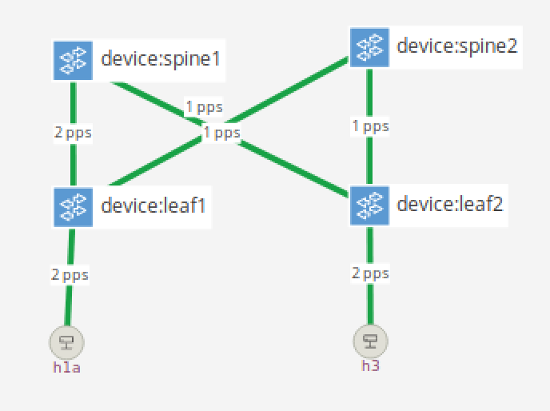
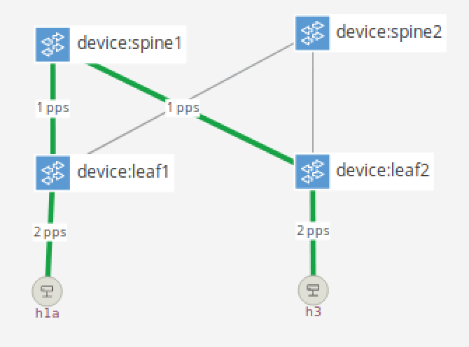

# Exercise 6: Segment Routing v6 (SRv6)

In this exercise, you will be implementing a simplified version of segment
routing, a source routing method that steers traffic through a specified set of
nodes.

## Background

This exercise is based on an IETF draft specification called SRv6, which uses
IPv6 packets to frame traffic that follows an SRv6 policy. SRv6 packets use the
IPv6 routing header, and they can either encapsulate IPv6 (or IPv4) packets
entirely or they can just inject an IPv6 routing header into an existing IPv6
packet.

The IPv6 routing header looks as follows:
```
     0                   1                   2                   3
     0 1 2 3 4 5 6 7 8 9 0 1 2 3 4 5 6 7 8 9 0 1 2 3 4 5 6 7 8 9 0 1
    +-+-+-+-+-+-+-+-+-+-+-+-+-+-+-+-+-+-+-+-+-+-+-+-+-+-+-+-+-+-+-+-+
    | Next Header   |  Hdr Ext Len  | Routing Type  | Segments Left |
    +-+-+-+-+-+-+-+-+-+-+-+-+-+-+-+-+-+-+-+-+-+-+-+-+-+-+-+-+-+-+-+-+
    |  Last Entry   |     Flags     |              Tag              |
    +-+-+-+-+-+-+-+-+-+-+-+-+-+-+-+-+-+-+-+-+-+-+-+-+-+-+-+-+-+-+-+-+
    |                                                               |
    |            Segment List[0] (128 bits IPv6 address)            |
    |                                                               |
    |                                                               |
    +-+-+-+-+-+-+-+-+-+-+-+-+-+-+-+-+-+-+-+-+-+-+-+-+-+-+-+-+-+-+-+-+
    |                                                               |
    |                                                               |
                                  ...
    |                                                               |
    |                                                               |
    +-+-+-+-+-+-+-+-+-+-+-+-+-+-+-+-+-+-+-+-+-+-+-+-+-+-+-+-+-+-+-+-+
    |                                                               |
    |            Segment List[n] (128 bits IPv6 address)            |
    |                                                               |
    |                                                               |
    +-+-+-+-+-+-+-+-+-+-+-+-+-+-+-+-+-+-+-+-+-+-+-+-+-+-+-+-+-+-+-+-+
```

The **Next Header** field is the type of either the next IPv6 header or the
payload.

For SRv6, the **Routing Type** is 4.

**Segments Left** points to the index of the current segment in the segment
list. In properly formed SRv6 packets, the IPv6 destination address equals
`Segment List[Segments Left]`. The original IPv6 address should be `Segment
List[0]` in our exercise so that traffic is routed to the correct destination
eventually.

**Last Entry** is the index of the last entry in the segment list.

Note: This means it should be one less than the length of the list. (In the
example above, the list is `n+1` entries and last entry should be `n`.)

Finally, the **Segment List** is a reverse-sorted list of IPv6 addresses to be
traversed in a specific SRv6 policy. The last entry in the list is the first
segment in the SRv6 policy. The list is not typically mutated; the entire header
is inserted or removed as a whole.

To keep things simple and because we are already using IPv6, your solution will
just be adding the routing header to the existing IPv6 packet. (We won't be
embedding entire packets inside of new IPv6 packets with an SRv6 policy,
although the spec allows it and there are valid use cases for doing so.)

As you may have already noticed, SRv6 uses IPv6 addresses to identify segments
in a policy. While the format of the addresses is the same as IPv6, the address
space is typically different from the space used for switch's internal IPv6
addresses. The format of the address also differs. A typical IPv6 unicast
address is broken into a network prefix and host identifier pieces, and a subnet
mask is used to delineate the boundary between the two. A typical SRv6 segment
identifier (SID) is broken into a locator, a function identifier, and
optionally, function arguments. The locator must be routable, which enables both
SRv6-enable and unaware nodes to participate in forwarding.

HINT: Due to optional arguments, longest prefix match on the 128-bit SID is
preferred to exact match.

There are three types of nodes of interest in a segment routed network:

1. Source Node - the node (either host or switch) that injects the SRv6 policy.
2. Transit Node - a node that forwards an SRv6 packet, but is not the
   destination for the traffic
3. Endpoint Node - a participating waypoint in an SRv6 policy that will modify
   the SRv6 header and perform a specified function

In our implementation, we simplify these types into two roles:

* Endpoint Node - for traffic to the switch's SID, update the SRv6 header
  (decrement segments left), set the IPv6 destination address to the next
  segment, and forward the packets ("End" behavior). For simplicity, we will
  always remove the SRv6 header on the penultimate segment in the policy (called
  Penultimate Segment Pop or PSP in the spec).

* Transit Node - by default, forward traffic normally if it is not destined for
  the switch's IP address or its SID ("T" behavior). Allow the control plane to
  add rules to inject SRv6 policy for traffic destined to specific IPv6
  addresses ("T.Insert" behavior).

For more details, you can read the draft specification here:
https://tools.ietf.org/id/draft-filsfils-spring-srv6-network-programming-06.html


## 1. Adding tables for SRv6

We have already defined the SRv6 header as well as included the logic for
parsing the header in `main.p4`.

The next step is to add two for each of the two roles specified above.
In addition to the tables, you will also need to write the action for the
endpoint node table (otherwise called the "My SID" table); in `snippets.p4`, we
have provided the `t_insert` actions for policies of length 2 and 3, which
should be sufficient to get you started.

Once you've finished that, you will need to apply the tables in the `apply`
block at the bottom of your `EgressPipeImpl` section. You will want to apply the
tables after checking that the L2 destination address matches the switch's, and
before the L3 table is applied (because you'll want to use the same routing
entries to forward traffic after the SRv6 policy is applied). You can also apply
the PSP behavior as part of your `apply` logic because we will always be
applying it if we are the penultimate SID.

## 2. Testing the pipeline with Packet Test Framework (PTF)

In this exercise, you will be modifying tests in [srv6.py](ptf/tests/srv6.py) to
verify the SRv6 behavior of the pipeline.

There are four tests in `srv6.py`:

* Srv6InsertTest: Tests SRv6 insert behavior, where the switch receives an IPv6
  packet and inserts the SRv6 header.

* Srv6TransitTest: Tests SRv6 transit behavior, where the switch ignores the
  SRv6 header and routes the packet normally, without applying any SRv6-related
  modifications.

* Srv6EndTest: Tests SRv6 end behavior (without pop), where the switch forwards
  the packet to the next SID found in the SRv6 header.

* Srv6EndPspTest: Tests SRv6 End with Penultimate Segment Pop (PSP) behavior,
  where the switch SID is the penultimate in the SID list and the switch removes
  the SRv6 header before routing the packet to it's final destination (last SID
  in the list).

You should be able to find `TODO EXERCISE 6` in [srv6.py](ptf/tests/srv6.py)
with some hints.

To run all the tests for this exercise:

    make p4-test TEST=srv6

This command will run all tests in the `srv6` group (i.e. the content of
`ptf/tests/srv6.py`). To run a specific test case you can use:

    make p4-test TEST=<PYTHON MODULE>.<TEST CLASS NAME>

For example:

    make p4-test TEST=srv6.Srv6InsertTest

**Check for regressions**

At this point, our P4 program should be complete. We can check to make sure that
we haven't broken anything from the previous exercises by running all tests from
the `ptf/tests` directory:

```
$ make p4-test
```

Now we have shown that we can install basic rules and pass SRv6 traffic using BMv2.

## 3. Building the ONOS App

For the ONOS application, you will need to update `Srv6Component.java` in the
following ways:

* Complete the `setUpMySidTable` method which will insert an entry into the M
  SID table that matches the specified device's SID and performs the `end`
  action. This function is called whenever a new device is connected.

* Complete the `insertSrv6InsertRule` function, which creates a `t_insert` rule
  along for the provided SRv6 policy. This function is called by the
  `srv6-insert` CLI command.

* Complete the `clearSrv6InsertRules`, which is called by the `srv6-clear` CLI
  command.

Once you are finished, you should rebuild and reload your app. This will also
rebuild and republish any changes to your P4 code and the ONOS pipeconf. Don't
forget to enable your Srv6Component at the top of the file.

As with previous exercises, you can use the following command to build and
reload the app:

```
$ make app-build app-reload
```

## 4. Inserting SRv6 policies

The next step is to show that traffic can be steered using an SRv6 policy.

You should start a ping between `h2` and `h4`:
```
mininet> h2 ping h4
```

Using the ONOS UI, you can observe which paths are being used for the ping
packets.

- Press `a` until you see "Port stats (packets/second)"
- Press `l` to show device labels



Once you determine which of the spines your packets are being hashed to (and it
could be both, with requests and replies taking different paths), you should
insert a set of SRv6 policies that sends the ping packets via the other spine
(or the spine of your choice).

To add new SRv6 policies, you should use the `srv6-insert` command.

```
onos> srv6-insert <device ID> <segment list>
```

Note: In our topology, the SID for spine1 is `3:201:2::` and the SID for spine
is `3:202:2::`.

For example, to add a policy that forwards traffic between h2 and h4 though
spine1 and leaf2, you can use the following command:

* Insert the SRv6 policy from h2 to h4 on leaf1 (through spine1 and leaf2)
```
onos> srv6-insert device:leaf1 3:201:2:: 3:102:2:: 2001:2:4::1
Installing path on device device:leaf1: 3:201:2::, 3:102:2::, 2001:2:4::1
```
* Insert the SRv6 policy from h4 to h2 on leaf2 (through spine1 and leaf1)
```
onos> srv6-insert device:leaf2 3:201:2:: 3:101:2:: 2001:1:2::1
Installing path on device device:leaf2: 3:201:2::, 3:101:2::, 2001:1:2::1
```

These commands will match on traffic to the last segment on the specified device
(e.g. match `2001:1:4::1` on `leaf1`). You can update the command to allow for
more specific match criteria as extra credit.

You can confirm that your rule has been added using a variant of the following:

(HINT: Make sure to update the tableId to match the one in your P4 program.)

```
onos> flows any device:leaf1 | grep tableId=IngressPipeImpl.srv6_transit
    id=c000006d73f05e, state=ADDED, bytes=0, packets=0, duration=871, liveType=UNKNOWN, priority=10,
    tableId=IngressPipeImpl.srv6_transit,
    appId=org.p4.srv6-tutorial,
    selector=[hdr.ipv6.dst_addr=0x20010001000400000000000000000001/128],
    treatment=DefaultTrafficTreatment{immediate=[
        IngressPipeImpl.srv6_t_insert_3(
            s3=0x20010001000400000000000000000001,
            s1=0x30201000200000000000000000000,
            s2=0x30102000200000000000000000000)],
    deferred=[], transition=None, meter=[], cleared=false, StatTrigger=null, metadata=null}
```

You should now return to the ONOS UI to confirm that traffic is flowing through
the specified spine.



## 5. Debugging and Clean Up

If you need to remove your SRv6 policies, you can use the `srv6-clear` command
to clear all SRv6 policies from a specific device. For example to remove flows
from `leaf1`, use this command:

```
onos> srv6-clear device:leaf1
```

To verify that the device inserts the correct SRv6 header, you can use
**Wireshark** to capture packet from each device port.

For example, if you want to capture packet from port 1 of spine1, capture
packets from interface `spine1-eth1`.

NOTE: `spine1-eth1` is connected to leaf1, and `spine1-eth2` is connected to
leaf2; spine two follows the same pattern.

## Congratulations!

You have completed the sixth exercise! Now your fabric is capable of steering
traffic using SRv6.
