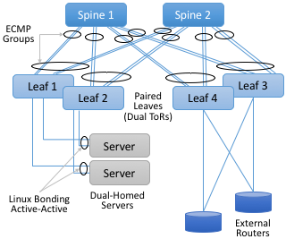
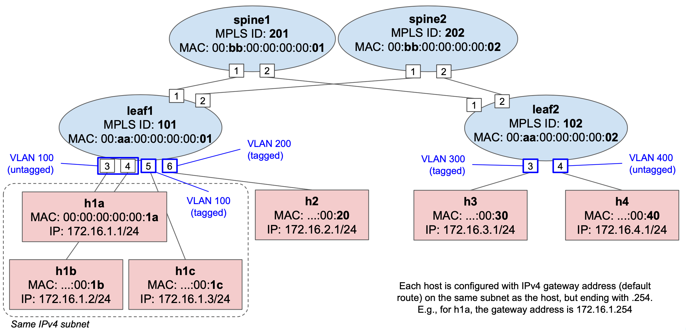

# Exercise 7: Trellis Basics

The goal of this exercise is to learn how to set up and configure an emulated
Trellis environment with a simple 2x2 topology.

## Background

Trellis is a set of built-in ONOS applications that provide the control plane
for an IP fabric based on MPLS segment-routing. That is, similar in purpose to
the app we have been developing in the previous exercise, but instead of using
IPv6-based routing or SRv6, Trellis uses MPLS labels to forward packets between
leaf switches and across the spines.

Trellis apps are deployed in Tier-1 carrier networks, and for this reason they
are deemed production-grade. These apps provide an extensive feature set such
as:

* Carrier-oriented networking capabilities: from basic L2 and L3 forwarding, to
  multicast, QinQ, pseudo-wires, integration with external control planes such
  as BGP, OSPF, DHCP relay, etc.
* Fault-tolerance and high-availability: as Trellis is designed to take full
  advantage of the ONOS distributed core, e.g., to withstand controller
  failures. It also provides dataplane-level resiliency against link failures
  and switch failures (with paired leaves and dual-homed hosts). See figure
  below.
* Single-pane-of-glass monitoring and troubleshooting, with dedicated tools such
  as T3.




Trellis is made of several apps running on top of ONOS, the main one is
`segmentrouting`, and its implementation can be found in the ONOS source tree:
[onos/apps/segmentrouting] (open on GitHub)

`segmentrouting` abstracts the leaf and spine switches to make the fabric appear
as "one big IP router", such that operators can program them using APIs similar
to that of a traditional router (e.g. to configure VLANs, subnets, routes, etc.)
The app listens to operator-provided configuration, as well as topology events,
to program the switches with the necessary forwarding rules. Because of this
"one big IP router" abstraction, operators can independently scale the topology
to add more capacity or ports by adding more leaves and spines.

`segmentrouting` and other Trellis apps use the ONOS FlowObjective API, which
allow them to be pipeline-agnostic. As a matter of fact, Trellis was initially
designed to work with fixed-function switches exposing an OpenFlow agent (such
as Broadcom Tomahawk, Trident2, and Qumran via the OF-DPA pipeline). However, in
recent years, support for P4 programmable switches was enabled without changing
the Trellis apps, but instead providing a special ONOS pipeconf that brings in a
P4 program complemented by a set of drivers that among other things are
responsible for translating flow objectives to the P4 program-specific tables.

This P4 program is named `fabric.p4`. It's implementation along with the
corresponding pipeconf drivers can be found in the ONOS source tree:
[onos/pipelines/fabric] (open on GitHub)

This pipeconf currently works on the `stratum_bmv2` software switch as well as
on Intel Barefoot Tofino-based switches (the [fabric-tofino] project provides
instructions and scripts to create a Tofino-enabled pipeconf).

We will come back to the details of `fabric.p4` in the next lab, for now, let's
keep in mind that instead of building our own custom pipeconf, we will use one
provided with ONOS.

The goal of the exercise is to learn the Trellis basics by writing a
configuration in the form of a netcfg JSON file to set up bridging and
IPv4 routing of traffic between hosts.

For a gentle overview of Trellis, please check the online book
"Software-Defined Networks: A Systems Approach":
<https://sdn.systemsapproach.org/trellis.html>

Finally, the official Trellis documentation is also available online:
<https://docs.trellisfabric.org/>

### Topology

We will use a topology similar to previous exercises, however, instead of IPv6
we will use IPv4 hosts. The topology file is located under
[mininet/topo-v4.py][topo-v4.py]. While the Trellis apps support IPv6, the P4
program does not, yet. Development of IPv6 support in `fabric.p4` is work in
progress.



Exactly like in previous exercises, the Mininet script [topo-v4.py] used here
defines 4 IPv4 subnets:

* `172.16.1.0/24` with 3 hosts connected to `leaf1` (`h1a`, `h1b`, and `h1c`)
* `172.16.2.0/24` with 1 hosts connected to `leaf1` (`h2`)
* `172.16.3.0/24` with 1 hosts connected to `leaf2` (`h3`)
* `172.16.4.0/24` with 1 hosts connected to `leaf2` (`h4`)

### VLAN tagged vs. untagged ports

As usually done in a traditional router, different subnets are associated to
different VLANs. For this reason, Trellis allows configuring ports with
different VLANs, either untagged or tagged.

An **untagged** port expects packets to be received and sent **without** a VLAN
tag, but internally, the switch processes all packets as belonging to a given
pre-configured VLAN ID. Similarly, when transmitting packets, the VLAN tag is
removed.

For **tagged** ports, packets are expected to be received **with** a VLAN tag
that has ID that belongs to a pre-configured set of known ones. Packets received
untagged or with an unknown VLAN ID, are dropped.

In our topology, we want the following VLAN configuration:

* `leaf1` port `3` and `4`: VLAN `100` untagged (host `h1a` and `h1b`)
* `leaf1` port `5`: VLAN `100` tagged (`h1c`)
* `leaf1` port `6`: VLAN `200` tagged (`h2`)
* `leaf2` port `3`: VLAN `300` tagged (`h3`)
* `leaf2` port `4`: VLAN `400` untagged (`h4`)

In the Mininet script [topo-v4.py], we use different host Python classes to
create untagged and tagged hosts.

For example, for `h1a` attached to untagged port `leaf1-3`, we use the
`IPv4Host` class:
```
# Excerpt from mininet/topo-v4.py
h1a = self.addHost('h1a', cls=IPv4Host, mac="00:00:00:00:00:1A",
                   ip='172.16.1.1/24', gw='172.16.1.254')
```

For `h2`, which instead is attached to tagged port `leaf1-6`, we use the
`TaggedIPv4Host` class:

```
h2 = self.addHost('h2', cls=TaggedIPv4Host, mac="00:00:00:00:00:20",
                  ip='172.16.2.1/24', gw='172.16.2.254', vlan=200)
```

In the same Python file, you can find the implementation for both classes. For
`TaggedIPv4Host` we use standard Linux commands to create a VLAN tagged
interface.

### Configuration via netcfg

The JSON file in [mininet/netcfg-sr.json][netcfg-sr.json] includes the necessary
configuration for ONOS and the Trellis apps to program switches to forward
traffic between hosts of the topology described above.

**NOTE**: this is a similar but different file then the one used in previous
exercises. Notice the `-sr` suffix, where `sr` stands for `segmentrouting`, as
this file contains the necessary configuration for such app to work.

Take a look at both the old file ([netcfg.json]) and the new one
([netcfg-sr.json]), can you spot the differences? To help, try answering the
following questions:

* What is the pipeconf ID used for all 4 switches? Which
  pipeconf ID did we use before? Why is it different?
* In the new file, each device has a `"segmentrouting"` config block (JSON
  subtree). Do you see any similarities with the previous file and the
  `"fabricDeviceConfig"` block?
* How come all `"fabricDeviceConfig"` blocks are gone in the new file?
* Look at the `"interfaces"` config blocks, what has changed w.r.t. the old
  file?
* In the new file, why do the untagged interfaces have only one VLAN ID value,
  while the tagged ones can take many (JSON array)?
* Is the `interfaces` block provided for all host-facing ports? Which ports are
  missing and which hosts are attached to those ports?


## 1. Restart ONOS and Mininet with the IPv4 topology

Since we want to use a new topology with IPv4 hosts, we need to reset the
current environment:

    $ make reset

This command will stop ONOS and Mininet and remove any state associated with
them.

Re-start ONOS and Mininet, this time with the new IPv4 topology:

**IMPORTANT:** please notice the `-v4` suffix!

    $ make start-v4

Wait about 1 minute before proceeding with the next steps. This will
give ONOS time to start all of its subsystems.

## 2. Load fabric pipeconf and segmentrouting

Differently from previous exercises, instead of building and installing our own
pipeconf and app, here we use built-in ones.

Open up the ONOS CLI (`make onos-cli`) and activate the following apps:

    onos> app activate fabric 
    onos> app activate segmentrouting

**NOTE:** The full ID for both apps is `org.onosproject.pipelines.fabric` and
`org.onosproject.segmentrouting`, respectively. For convenience, when activating
built-in apps using the ONOS CLI, you can specify just the last piece of the
full ID (after the last dot.)

**NOTE 2:** The `fabric` app has the minimal purpose of registering
pipeconfs in the system. Different from `segmentrouting`, even if we
call them both apps, `fabric` does not interact with the network in
any way.

#### Verify apps

Verify that all apps have been activated successfully:

    onos> apps -s -a
    *  18 org.onosproject.drivers               2.2.2    Default Drivers
    *  37 org.onosproject.protocols.grpc        2.2.2    gRPC Protocol Subsystem
    *  38 org.onosproject.protocols.gnmi        2.2.2    gNMI Protocol Subsystem
    *  39 org.onosproject.generaldeviceprovider 2.2.2    General Device Provider
    *  40 org.onosproject.protocols.gnoi        2.2.2    gNOI Protocol Subsystem
    *  41 org.onosproject.drivers.gnoi          2.2.2    gNOI Drivers
    *  42 org.onosproject.route-service         2.2.2    Route Service Server
    *  43 org.onosproject.mcast                 2.2.2    Multicast traffic control
    *  44 org.onosproject.portloadbalancer      2.2.2    Port Load Balance Service
    *  45 org.onosproject.segmentrouting        2.2.2    Segment Routing
    *  53 org.onosproject.hostprovider          2.2.2    Host Location Provider
    *  54 org.onosproject.lldpprovider          2.2.2    LLDP Link Provider
    *  64 org.onosproject.protocols.p4runtime   2.2.2    P4Runtime Protocol Subsystem
    *  65 org.onosproject.p4runtime             2.2.2    P4Runtime Provider
    *  99 org.onosproject.drivers.gnmi          2.2.2    gNMI Drivers
    * 100 org.onosproject.drivers.p4runtime     2.2.2    P4Runtime Drivers
    * 101 org.onosproject.pipelines.basic       2.2.2    Basic Pipelines
    * 102 org.onosproject.drivers.stratum       2.2.2    Stratum Drivers
    * 103 org.onosproject.drivers.bmv2          2.2.2    BMv2 Drivers
    * 111 org.onosproject.pipelines.fabric      2.2.2    Fabric Pipeline
    * 164 org.onosproject.gui2                  2.2.2    ONOS GUI2

Verify that you have the above 20 apps active in your ONOS instance. If you are
wondering why so many apps, remember from EXERCISE 3 that the ONOS container in
[docker-compose.yml] is configured to pass the environment variable `ONOS_APPS`
which defines built-in apps to load during startup.

In our case this variable has value:

    ONOS_APPS=gui2,drivers.bmv2,lldpprovider,hostprovider

Moreover, `segmentrouting` requires other apps as dependencies, such as
`route-service`, `mcast`, and `portloadbalancer`. The combination of all these
apps (and others that we do not need in this exercise) is what makes Trellis.

#### Verify pipeconfs

Verify that the `fabric` pipeconfs have been registered successfully:

    onos> pipeconfs
    id=org.onosproject.pipelines.fabric-full, behaviors=[PortStatisticsDiscovery, PiPipelineInterpreter, Pipeliner, IntProgrammable], extensions=[P4_INFO_TEXT, BMV2_JSON, CPU_PORT_TXT]
    id=org.onosproject.pipelines.int, behaviors=[PiPipelineInterpreter, Pipeliner, PortStatisticsDiscovery, IntProgrammable], extensions=[P4_INFO_TEXT, BMV2_JSON]
    id=org.onosproject.pipelines.fabric-spgw-int, behaviors=[PortStatisticsDiscovery, PiPipelineInterpreter, Pipeliner, IntProgrammable], extensions=[P4_INFO_TEXT, BMV2_JSON, CPU_PORT_TXT]
    id=org.onosproject.pipelines.fabric, behaviors=[PortStatisticsDiscovery, PiPipelineInterpreter, Pipeliner], extensions=[P4_INFO_TEXT, BMV2_JSON, CPU_PORT_TXT]
    id=org.onosproject.pipelines.fabric-bng, behaviors=[PortStatisticsDiscovery, PiPipelineInterpreter, Pipeliner, BngProgrammable], extensions=[P4_INFO_TEXT, BMV2_JSON, CPU_PORT_TXT]
    id=org.onosproject.pipelines.fabric-spgw, behaviors=[PortStatisticsDiscovery, PiPipelineInterpreter, Pipeliner], extensions=[P4_INFO_TEXT, BMV2_JSON, CPU_PORT_TXT]
    id=org.onosproject.pipelines.fabric-int, behaviors=[PortStatisticsDiscovery, PiPipelineInterpreter, Pipeliner, IntProgrammable], extensions=[P4_INFO_TEXT, BMV2_JSON, CPU_PORT_TXT]
    id=org.onosproject.pipelines.basic, behaviors=[PiPipelineInterpreter, Pipeliner, PortStatisticsDiscovery], extensions=[P4_INFO_TEXT, BMV2_JSON]

Wondering why so many pipeconfs? `fabric.p4` comes in different "profiles", used
to enable different dataplane features in the pipeline. We'll come back
to the differences between different profiles in the next exercise, for now
let's make sure the basic one `org.onosproject.pipelines.fabric` is loaded.
This is the one we need to program all four switches, as specified in
[netcfg-sr.json].

#### Increase reconciliation frequency (optional, but recommended)

Run the following commands in the ONOS CLI:

    onos> cfg set org.onosproject.net.flow.impl.FlowRuleManager fallbackFlowPollFrequency 4
    onos> cfg set org.onosproject.net.group.impl.GroupManager fallbackGroupPollFrequency 3

This command tells the ONOS core to modify the period (in seconds) between
reconciliation checks. Reconciliation is used to verify that switches have the
expected forwarding state and to correct any inconsistencies, i.e., writing any
pending flow rule and group. When running ONOS and the emulated switches in the
same machine (especially those with low CPU/memory), it might happen that
P4Runtime write requests time out because the system is overloaded.

The default reconciliation period is 30 seconds, the above commands set it to 4
seconds for flow rules, and 3 seconds for groups.

## 3. Push netcfg-sr.json to ONOS

On a terminal window, type:

**IMPORTANT**: please notice the `-sr` suffix!

    $ make netcfg-sr

As we learned in EXERCISE 3, this command will push [netcfg-sr.json] to ONOS,
triggering discovery and configuration of the 4 switches. Moreover, since the
file specifies a `segmentrouting` config block for each switch, this will
instruct the `segmentrouting` app in ONOS to take control of all of them, i.e.,
the app will start generating flow objectives that will be translated into flow
rules for the `fabric.p4` pipeline.

Check the ONOS log (`make onos-log`). You should see numerous messages from
components such as `TopologyHandler`, `LinkHandler`, `SegmentRoutingManager`,
etc., signaling that switches have been discovered and programmed.

You should also see warning messages such as:

```
[ForwardingObjectiveTranslator] Cannot translate DefaultForwardingObjective: unsupported forwarding function type 'PSEUDO_WIRE'...
```

This is normal, as not all Trellis features are supported in `fabric.p4`. One of
such feature is [pseudo-wire] (L2 tunneling across the L3 fabric). You can
ignore that.

This error is generated by the Pipeliner driver behavior of the `fabric`
pipeconf, which recognizes that the given flow objective cannot be translated.

#### Check configuration in ONOS

Verify that all interfaces have been configured successfully:

    onos> interfaces
    leaf1-3: port=device:leaf1/3 ips=[172.16.1.254/24] mac=00:AA:00:00:00:01 vlanUntagged=100
    leaf1-4: port=device:leaf1/4 ips=[172.16.1.254/24] mac=00:AA:00:00:00:01 vlanUntagged=100
    leaf1-5: port=device:leaf1/5 ips=[172.16.1.254/24] mac=00:AA:00:00:00:01 vlanTagged=[100]
    leaf1-6: port=device:leaf1/6 ips=[172.16.2.254/24] mac=00:AA:00:00:00:01 vlanTagged=[200]

You should see four interfaces in total (for all host-facing ports of `leaf1`),
configured as in the [netcfg-sr.json] file. You will have to add the
configuration for `leaf2`'s ports later in this exercise.

A similar output can be obtained by using a `segmentrouting`-specific command:

    onos> sr-device-subnets
    device:leaf1
        172.16.1.0/24
        172.16.2.0/24
    device:spine1
    device:spine2
    device:leaf2

This command lists all device-subnet mapping known to `segmentrouting`. For a
list of other available sr-specific commands, type `sr-` and press
<kbd>tab</kbd> (as for command auto-completion).

Another interesting command is `sr-ecmp-spg`, which lists all computed ECMP
shortest-path graphs:

    onos> sr-ecmp-spg 
    Root Device: device:leaf1 ECMP Paths: 
      Paths from device:leaf1 to device:spine1
           ==  : device:leaf1/1 -> device:spine1/1
      Paths from device:leaf1 to device:spine2
           ==  : device:leaf1/2 -> device:spine2/1
      Paths from device:leaf1 to device:leaf2
           ==  : device:leaf1/2 -> device:spine2/1 : device:spine2/2 -> device:leaf2/2
           ==  : device:leaf1/1 -> device:spine1/1 : device:spine1/2 -> device:leaf2/1

    Root Device: device:spine1 ECMP Paths: 
      Paths from device:spine1 to device:leaf1
           ==  : device:spine1/1 -> device:leaf1/1
      Paths from device:spine1 to device:spine2
           ==  : device:spine1/2 -> device:leaf2/1 : device:leaf2/2 -> device:spine2/2
           ==  : device:spine1/1 -> device:leaf1/1 : device:leaf1/2 -> device:spine2/1
      Paths from device:spine1 to device:leaf2
           ==  : device:spine1/2 -> device:leaf2/1

    Root Device: device:spine2 ECMP Paths: 
      Paths from device:spine2 to device:leaf1
           ==  : device:spine2/1 -> device:leaf1/2
      Paths from device:spine2 to device:spine1
           ==  : device:spine2/1 -> device:leaf1/2 : device:leaf1/1 -> device:spine1/1
           ==  : device:spine2/2 -> device:leaf2/2 : device:leaf2/1 -> device:spine1/2
      Paths from device:spine2 to device:leaf2
           ==  : device:spine2/2 -> device:leaf2/2

    Root Device: device:leaf2 ECMP Paths: 
      Paths from device:leaf2 to device:leaf1
           ==  : device:leaf2/1 -> device:spine1/2 : device:spine1/1 -> device:leaf1/1
           ==  : device:leaf2/2 -> device:spine2/2 : device:spine2/1 -> device:leaf1/2
      Paths from device:leaf2 to device:spine1
           ==  : device:leaf2/1 -> device:spine1/2
      Paths from device:leaf2 to device:spine2
           ==  : device:leaf2/2 -> device:spine2/2

These graphs are used by `segmentrouting` to program flow rules and groups
(action selectors) in `fabric.p4`, needed to load balance traffic across
multiple spines/paths.

Verify that no hosts have been discovered so far:

    onos> hosts

You should get an empty output.

Verify that all initial flows and groups have be programmed successfully:

    onos> flows -c added
    deviceId=device:leaf1, flowRuleCount=52
    deviceId=device:spine1, flowRuleCount=28
    deviceId=device:spine2, flowRuleCount=28
    deviceId=device:leaf2, flowRuleCount=36
    onos> groups -c added
    deviceId=device:leaf1, groupCount=5
    deviceId=device:leaf2, groupCount=3
    deviceId=device:spine1, groupCount=5
    deviceId=device:spine2, groupCount=5

You should see the same `flowRuleCount` and `groupCount` in your
output. To dump the whole set of flow rules and groups, remove the
`-c` argument from the command. `added` is used to filter only
entities that are known to have been written to the switch (i.e., the
P4Runtime Write RPC was successful.)

## 4. Connectivity test

#### Same-subnet hosts (bridging)

Open up the Mininet CLI (`make mn-cli`). Start by pinging `h1a` and `h1c`,
which are both on the same subnet (VLAN `100` 172.16.1.0/24):

    mininet> h1a ping h1c
    PING 172.16.1.3 (172.16.1.3) 56(84) bytes of data.
    64 bytes from 172.16.1.3: icmp_seq=1 ttl=63 time=13.7 ms
    64 bytes from 172.16.1.3: icmp_seq=2 ttl=63 time=3.63 ms
    64 bytes from 172.16.1.3: icmp_seq=3 ttl=63 time=3.52 ms
    ...

Ping should work. Check the ONOS log, you should see an output similar to that
of exercises 4-5.

    [HostHandler] Host 00:00:00:00:00:1A/None is added at [device:leaf1/3]
    [HostHandler] Populating bridging entry for host 00:00:00:00:00:1A/None at device:leaf1:3
    [HostHandler] Populating routing rule for 172.16.1.1 at device:leaf1/3
    [HostHandler] Host 00:00:00:00:00:1C/100 is added at [device:leaf1/5]
    [HostHandler] Populating bridging entry for host 00:00:00:00:00:1C/100 at device:leaf1:5
    [HostHandler] Populating routing rule for 172.16.1.3 at device:leaf1/5

That's because `segmentrouting` operates in a way that is similar to the custom
app of previous exercises. Hosts are discovered by the built-in service
`hostprovider` intercepting packets such as ARP or NDP. For hosts in the same
subnet, to support ARP resolution, multicast (ALL) groups are used to replicate
ARP requests to all ports belonging to the same VLAN. `segmentrouting` listens
for host events, when a new one is discovered, it installs the necessary
bridging and routing rules.

#### Hosts on different subnets (routing)

On the Mininet prompt, start a ping to `h2` from any host in the subnet with
VLAN `100`, for example, from `h1a`:

    mininet> h1a ping h2

The **ping should NOT work**, and the reason is that the location of `h2` is not
known to ONOS, yet. Usually, Trellis is used in networks where hosts use DHCP
for addressing. In such setup, we could use the DHCP relay app in ONOS to learn
host locations and addresses when the hosts request an IP address via DHCP.
However, in this simpler topology, we need to manually trigger `h2` to generate
some packets to be discovered by ONOS.

When using `segmentrouting`, the easiest way to have ONOS discover an host, is
to ping the gateway address that we configured in [netcfg-sr.json], or that you
can derive from the ONOS CLI (`onos> interfaces`):

    mininet> h2 ping 172.16.2.254
    PING 172.16.2.254 (172.16.2.254) 56(84) bytes of data.
    64 bytes from 172.16.2.254: icmp_seq=1 ttl=64 time=28.9 ms
    64 bytes from 172.16.2.254: icmp_seq=2 ttl=64 time=12.6 ms
    64 bytes from 172.16.2.254: icmp_seq=3 ttl=64 time=15.2 ms
    ...

Ping is working, and ONOS should have discovered `h2` by now. But, who is
replying to our pings?

If you check the ARP table for h2:

    mininet> h2 arp
    Address                  HWtype  HWaddress           Flags Mask            Iface
    172.16.2.254             ether   00:aa:00:00:00:01   C                     h2-eth0.200

You should recognize MAC address `00:aa:00:00:00:01` as the one associated with
`leaf1` in [netcfg-sr.json]. That's it, the `segmentrouting` app in ONOS is
replying to our ICMP echo request (ping) packets! Ping requests are intercepted
by means of P4Runtime packet-in, while replies are generated and injected via
P4Runtime packet-out. This is equivalent to pinging the interface of a
traditional router.

At this point, ping from `h1a` to `h2` should work:

    mininet> h1a ping h2
    PING 172.16.2.1 (172.16.2.1) 56(84) bytes of data.
    64 bytes from 172.16.2.1: icmp_seq=1 ttl=63 time=6.23 ms
    64 bytes from 172.16.2.1: icmp_seq=2 ttl=63 time=3.81 ms
    64 bytes from 172.16.2.1: icmp_seq=3 ttl=63 time=3.84 ms
    ...

Moreover, you can check that all hosts pinged so far have been discovered by
ONOS:

    onos> hosts -s
    id=00:00:00:00:00:1A/None, mac=00:00:00:00:00:1A, locations=[device:leaf1/3], vlan=None, ip(s)=[172.16.1.1]
    id=00:00:00:00:00:1C/100, mac=00:00:00:00:00:1C, locations=[device:leaf1/5], vlan=100, ip(s)=[172.16.1.3]
    id=00:00:00:00:00:20/200, mac=00:00:00:00:00:20, locations=[device:leaf1/6], vlan=200, ip(s)=[172.16.2.1]

## 5. Dump packets to see VLAN tags (optional)

TODO: detailed instructions for this step are still a work-in-progress.

If you feel adventurous, start a ping between any two hosts, and use the tool
[util/mn-pcap](util/mn-pcap) to dump packets to a PCAP file. After dumping
packets, the tool tries to open the pcap file on wireshark (if installed).

For example, to dump packets out of the `h2` main interface:

    $ util/mn-pcap h2

## 6. Add missing interface config

Start a ping from `h3` to any other host, for example `h2`:

    mininet> h3 ping h2
    ...

It should NOT work. Can you explain why?

Let's check the ONOS log (`make onos-log`). You should see the following
messages:

    ...
    INFO  [HostHandler] Host 00:00:00:00:00:30/None is added at [device:leaf2/3]
    INFO  [HostHandler] Populating bridging entry for host 00:00:00:00:00:30/None at device:leaf2:3
    WARN  [RoutingRulePopulator] Untagged host 00:00:00:00:00:30/None is not allowed on device:leaf2/3 without untagged or nativevlan config
    WARN  [RoutingRulePopulator] Fail to build fwd obj for host 00:00:00:00:00:30/None. Abort.
    INFO  [HostHandler] 172.16.3.1 is not included in the subnet config of device:leaf2/3. Ignored.


`h3` is discovered because ONOS intercepted the ARP request to resolve `h3`'s
gateway IP address (`172.16.3.254`), but the rest of the programming fails
because we have not provided a valid Trellis configuration for the switch port
facing `h3` (`leaf2/3`). Indeed, if you look at [netcfg-sr.json] you will notice
that the `"ports"` section includes a config block for all `leaf1` host-facing
ports, but it does NOT provide any for `leaf2`.

As a matter of fact, if you try to start a ping from `h4` (attached to `leaf2`),
that should NOT work as well.

It is your task to modify the [netcfg-sr.json] to add the necessary config
blocks to enable connectivity for `h3` and `h4`:

1. Open up [netcfg-sr.json].
2. Look for the `"ports"` section.
3. Provide a config for ports `device:leaf2/3` and `device:leaf2/4`. When doing
   so, look at the config for other ports as a reference, but make sure to
   provide the right IPv4 gateway address, subnet, and VLAN configuration
   described at the beginning of this document.
4. When done, push the updated file to ONOS using `make netcfg-sr`.
5. Verify that the two new interface configs show up when using the ONOS
   CLI (`onos> interfaces`).
6. If you don't see the new interfaces in the ONOS CLI, verify the ONOS log
   (`make onos-log`) for any possible error, and eventually go back to step 3.
7. If you struggle to make it work, a solution is available in the
   `solution/mininet` directory.

Let's try to ping the corresponding gateway address from `h3` and `h4`:

    mininet> h3 ping 172.16.3.254
    PING 172.16.3.254 (172.16.3.254) 56(84) bytes of data.
    64 bytes from 172.16.3.254: icmp_seq=1 ttl=64 time=66.5 ms
    64 bytes from 172.16.3.254: icmp_seq=2 ttl=64 time=19.1 ms
    64 bytes from 172.16.3.254: icmp_seq=3 ttl=64 time=27.5 ms
    ...

    mininet> h4 ping 172.16.4.254
    PING 172.16.4.254 (172.16.4.254) 56(84) bytes of data.
    64 bytes from 172.16.4.254: icmp_seq=1 ttl=64 time=45.2 ms
    64 bytes from 172.16.4.254: icmp_seq=2 ttl=64 time=12.7 ms
    64 bytes from 172.16.4.254: icmp_seq=3 ttl=64 time=22.0 ms
    ...

At this point, ping between all hosts should work. You can try that using the
special `pingall` command in the Mininet CLI:

    mininet> pingall
    *** Ping: testing ping reachability
    h1a -> h1b h1c h2 h3 h4 
    h1b -> h1a h1c h2 h3 h4 
    h1c -> h1a h1b h2 h3 h4 
    h2 -> h1a h1b h1c h3 h4 
    h3 -> h1a h1b h1c h2 h4 
    h4 -> h1a h1b h1c h2 h3 
    *** Results: 0% dropped (30/30 received)

## Congratulations!

You have completed the seventh exercise! You were able to use ONOS built-in
Trellis apps such as `segmentrouting` and the `fabric` pipeconf to configure
forwarding in a 2x2 leaf-spine fabric of IPv4 hosts.

[topo-v4.py]: mininet/topo-v4.py
[netcfg-sr.json]: mininet/netcfg-sr.json
[netcfg.json]: mininet/netcfg.json
[docker-compose.yml]: docker-compose.yml
[pseudo-wire]: https://en.wikipedia.org/wiki/Pseudo-wire
[onos/apps/segmentrouting]: https://github.com/opennetworkinglab/onos/tree/2.2.2/apps/segmentrouting
[onos/pipelines/fabric]: https://github.com/opennetworkinglab/onos/tree/2.2.2/pipelines/fabric
[fabric-tofino]: https://github.com/opencord/fabric-tofino
