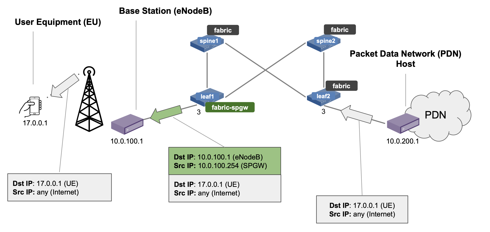

# Exercise 8: GTP termination with fabric.p4

The goal of this exercise is to learn how to use Trellis and fabric.p4 to
encapsulate and route packets using the GPRS Tunnelling Protocol (GTP) header as
in 4G mobile core networks.

## Background



The topology we will use in this exercise ([topo-gtp.py]) is a very simple one,
with the usual 2x2 fabric, but only two hosts. We assume our fabric is used as
part of a 4G (i.e, LTE) network, connecting base stations to a Packet Data
Network (PDN), such as the Internet. The two hosts in our topology represent:

* An eNodeB, i.e., a base station providing radio connectivity to User
  Equipments (UEs) such as smartphones;
* A host on the Packet Data Network (PDN), i.e., any host on the Internet.

To provide connectivity between the UEs and the Internet, we need to program our
fabric to act as a Serving and Packet Gateway (SPGW). The SPGW is a complex and
feature-rich component of the 4G mobile core architecture that is used by the
base stations as a gateway to the PDN. Base stations aggregate UE traffic in GTP
tunnels (one or more per UE). The SPGW has many functions, among which that of
terminating such tunnels. In other words, it encapsulates downlink traffic
(Internet→UE) in an additional IPv4+UDP+GTP-U header, and it removes it for the
uplink direction (UE→Internet).

In this exercise you will learn how to:

* Program a switch with the `fabric-spgw` profile;
* Use Trellis to route traffic from the PDN to the eNodeB;
* Use the ONOS REST APIs to enable GTP encapsulation of downlink traffic on
  `leaf1`.


## 1. Start ONOS and Mininet with GTP topology

Since we want to use a different topology, we need to reset the current
environment (if currently active):

    $ make reset

This command will stop ONOS and Mininet and remove any state associated with
them.

Re-start ONOS and Mininet, this time with the new topology:

**IMPORTANT:** please notice the `-gtp` suffix!

    $ make start-gtp

Wait about 1 minute before proceeding with the next steps, this will give time
to ONOS to start all of its subsystems.

## 2. Load additional apps

As in the previous exercises, let's activate the `segmentrouting` and `fabric`
pipeconf app using the ONOS CLI (`make onos-cli`):

    onos> app activate fabric 
    onos> app activate segmentrouting

Let's also activate a third app named `netcfghostprovider`:

    onos> app activate netcfghostprovider 

The `netcfghostprovider` (Network Config Host Provider ) is a built-in service
similar to the `hostprovider` (Host Location Provider) seen in the previous
exercises. It is responsible for registering hosts in the system, however,
differently from `hostprovider`, it does not listen for ARP or DHCP packet-ins
to automatically discover hosts. Instead, it uses information in the netcfg JSON
file, allowing operators to pre-populate the ONOS host store.

This is useful for static topologies and to avoid relying on ARP, DHCP, and
other host-generated traffic. In this exercise, we use the netcfg JSON to
configure the location of the `enodeb` and `pdn` hosts.

#### Verify apps

The complete list of apps should look like the following (21 in total)

    onos> apps -s -a
    *  18 org.onosproject.drivers              2.2.2    Default Drivers
    *  37 org.onosproject.protocols.grpc       2.2.2    gRPC Protocol Subsystem
    *  38 org.onosproject.protocols.gnmi       2.2.2    gNMI Protocol Subsystem
    *  39 org.onosproject.generaldeviceprovider 2.2.2    General Device Provider
    *  40 org.onosproject.protocols.gnoi       2.2.2    gNOI Protocol Subsystem
    *  41 org.onosproject.drivers.gnoi         2.2.2    gNOI Drivers
    *  42 org.onosproject.route-service        2.2.2    Route Service Server
    *  43 org.onosproject.mcast                2.2.2    Multicast traffic control
    *  44 org.onosproject.portloadbalancer     2.2.2    Port Load Balance Service
    *  45 org.onosproject.segmentrouting       2.2.2    Segment Routing
    *  53 org.onosproject.hostprovider         2.2.2    Host Location Provider
    *  54 org.onosproject.lldpprovider         2.2.2    LLDP Link Provider
    *  64 org.onosproject.protocols.p4runtime  2.2.2    P4Runtime Protocol Subsystem
    *  65 org.onosproject.p4runtime            2.2.2    P4Runtime Provider
    *  96 org.onosproject.netcfghostprovider   2.2.2    Network Config Host Provider
    *  99 org.onosproject.drivers.gnmi         2.2.2    gNMI Drivers
    * 100 org.onosproject.drivers.p4runtime    2.2.2    P4Runtime Drivers
    * 101 org.onosproject.pipelines.basic      2.2.2    Basic Pipelines
    * 102 org.onosproject.drivers.stratum      2.2.2    Stratum Drivers
    * 103 org.onosproject.drivers.bmv2         2.2.2    BMv2 Drivers
    * 111 org.onosproject.pipelines.fabric     2.2.2    Fabric Pipeline
    * 164 org.onosproject.gui2                 2.2.2    ONOS GUI2

#### Verify pipeconfs

All `fabric` pipeconf profiles should have been registered by now. Take a note
on the full ID of the one with SPGW capabilities (`fabric-spgw`), you will need
this ID in the next step.

    onos> pipeconfs
    id=org.onosproject.pipelines.fabric-full, behaviors=[PortStatisticsDiscovery, PiPipelineInterpreter, Pipeliner, IntProgrammable], extensions=[P4_INFO_TEXT, BMV2_JSON, CPU_PORT_TXT]
    id=org.onosproject.pipelines.int, behaviors=[PiPipelineInterpreter, Pipeliner, PortStatisticsDiscovery, IntProgrammable], extensions=[P4_INFO_TEXT, BMV2_JSON]
    id=org.onosproject.pipelines.fabric-spgw-int, behaviors=[PortStatisticsDiscovery, PiPipelineInterpreter, Pipeliner, IntProgrammable], extensions=[P4_INFO_TEXT, BMV2_JSON, CPU_PORT_TXT]
    id=org.onosproject.pipelines.fabric, behaviors=[PortStatisticsDiscovery, PiPipelineInterpreter, Pipeliner], extensions=[P4_INFO_TEXT, BMV2_JSON, CPU_PORT_TXT]
    id=org.onosproject.pipelines.fabric-bng, behaviors=[PortStatisticsDiscovery, PiPipelineInterpreter, Pipeliner, BngProgrammable], extensions=[P4_INFO_TEXT, BMV2_JSON, CPU_PORT_TXT]
    id=org.onosproject.pipelines.fabric-spgw, behaviors=[PortStatisticsDiscovery, PiPipelineInterpreter, Pipeliner], extensions=[P4_INFO_TEXT, BMV2_JSON, CPU_PORT_TXT]
    id=org.onosproject.pipelines.fabric-int, behaviors=[PortStatisticsDiscovery, PiPipelineInterpreter, Pipeliner, IntProgrammable], extensions=[P4_INFO_TEXT, BMV2_JSON, CPU_PORT_TXT]
    id=org.onosproject.pipelines.basic, behaviors=[PiPipelineInterpreter, Pipeliner, PortStatisticsDiscovery], extensions=[P4_INFO_TEXT, BMV2_JSON]

## 3. Modify and push netcfg to use fabric-spgw profile

Up until now, we have used topologies where all switches were configured with
the same pipeconf, and so the same P4 program.

In this exercise, we want all switches to run with the basic `fabric` profile,
while `leaf1` should act as the SPGW, and so we want it programmed with the
`fabric-spgw` profile.

#### Modify netcfg JSON

Let's modify the netcfg JSON to use the `fabric-spgw` profile on switch
`leaf1`.

1. Open up file [netcfg-gtp.json] and look for the configuration of `leaf1`
   in thw `"devices"` block. It should look like this:

    ```
      "devices": {
        "device:leaf1": {
          "basic": {
            "managementAddress": "grpc://mininet:50001?device_id=1",
            "driver": "stratum-bmv2",
            "pipeconf": "org.onosproject.pipelines.fabric",
    ...
    ```

2. Modify the `pipeconf` property to use the full ID of the `fabric-spgw`
   profile obtained in the previous step.

3. Save the file.

#### Push netcfg to ONOS

On a terminal window, type:

**IMPORTANT**: please notice the `-gtp` suffix!

    $ make netcfg-gtp

Use the ONOS CLI (`make onos-cli`) to verify that all 4 switches are connected
to ONOS and provisioned with the right pipeconf/profile.

    onos> devices -s
    id=device:leaf1, available=true, role=MASTER, type=SWITCH, driver=stratum-bmv2:org.onosproject.pipelines.fabric-spgw
    id=device:leaf2, available=true, role=MASTER, type=SWITCH, driver=stratum-bmv2:org.onosproject.pipelines.fabric
    id=device:spine1, available=true, role=MASTER, type=SWITCH, driver=stratum-bmv2:org.onosproject.pipelines.fabric
    id=device:spine2, available=true, role=MASTER, type=SWITCH, driver=stratum-bmv2:org.onosproject.pipelines.fabric

Make sure `leaf1` has driver with the `fabric-sgw` pipeconf, while all other
switches should have the basic `fabric` pipeconf.

##### Troubleshooting

If `leaf1` does NOT have `available=true`, it probably means that you have
inserted the wrong pipeconf ID in [netcfg-gtp.json] and ONOS is not able to
perform the initial provisioning.

Check the ONOS log (`make onos-log`) for possible errors. Remember from the
previous exercise that some errors are expected (e.g., for unsupported
`PSEUDO_WIRE` flow objectives). If you see an error like this:

    ERROR [DeviceTaskExecutor] Unable to complete task CONNECTION_SETUP for device:leaf1: pipeconf ... not registered

It means you have to go to the previous step to correct your pipeconf ID. Modify
the [netcfg-gtp.json] file and push it again using `make netcfg-gtp`. Use the
ONOS CLI and log to make sure the issue is fixed before proceeding.

#### Check configuration in ONOS

Check the interface configuration. In this topology we want `segmentrouting` to
forward traffic based on two IP subnets:

    onos> interfaces
    leaf1-3: port=device:leaf1/3 ips=[10.0.100.254/24] mac=00:AA:00:00:00:01 vlanUntagged=100
    leaf2-3: port=device:leaf2/3 ips=[10.0.200.254/24] mac=00:AA:00:00:00:02 vlanUntagged=200

Check that the `enodeb` and `pdn` hosts have been discovered:

    onos> hosts
    id=00:00:00:00:00:10/None, mac=00:00:00:00:00:10, locations=[device:leaf1/3], auxLocations=null, vlan=None, ip(s)=[10.0.100.1], ..., name=enodeb, ..., provider=host:org.onosproject.netcfghost, configured=true
    id=00:00:00:00:00:20/None, mac=00:00:00:00:00:20, locations=[device:leaf2/3], auxLocations=null, vlan=None, ip(s)=[10.0.200.1], ..., name=pdn, ..., provider=host:org.onosproject.netcfghost, configured=true

`provider=host:org.onosproject.netcfghost` and `configured=true` are indications
that the host entry was created by `netcfghostprovider`.

## 4. Verify IP connectivity between PDN and eNodeB

Since the two hosts have already been discovered, they should be pingable.

Using the Mininet CLI (`make mn-cli`) start a ping between `enodeb` and `pdn`:

    mininet> enodeb ping pdn
    PING 10.0.200.1 (10.0.200.1) 56(84) bytes of data.
    64 bytes from 10.0.200.1: icmp_seq=1 ttl=62 time=1053 ms
    64 bytes from 10.0.200.1: icmp_seq=2 ttl=62 time=49.0 ms
    64 bytes from 10.0.200.1: icmp_seq=3 ttl=62 time=9.63 ms
    ...

## 5. Start PDN and eNodeB processes

We have created two Python scripts to emulate the PDN sending downlink
traffic to the UEs, and the eNodeB, expecting to receive the
same traffic but GTP-encapsulated.

In a new terminal window, start the [send-udp.py] script on the `pdn` host:

    $ util/mn-cmd pdn /mininet/send-udp.py
    Sending 5 UDP packets per second to 17.0.0.1...

[util/mn-cmd] is a convenience script to run commands on mininet hosts when
using multiple terminal windows.

[mininet/send-udp.py][send-udp.py] generates packets with destination
IPv4 address `17.0.0.1` (UE address). In the rest of the exercise we
will configure Trellis to route these packets through switch `leaf1`, and
we will insert a flow rule in this switch to perform the GTP
encapsulation. For now, this traffic will be dropped at `leaf2`.

On a second terminal window, start the [recv-gtp.py] script on the `enodeb`
host:

```
$ util/mn-cmd enodeb /mininet/recv-gtp.py   
Will print a line for each UDP packet received...
```

[mininet/recv-gtp.py][recv-gtp.py] simply sniffs packets received and prints
them on screen, informing if the packet is GTP encapsulated or not. You should
see no packets being printed for the moment.

#### Use ONOS UI to visualize traffic

Using the ONF Cloud Tutorial Portal, access the ONOS UI.
If you are running a VM on your laptop, open up a browser
(e.g. Firefox) to <http://127.0.0.1:8181/onos/ui>.

When asked, use the username `onos` and password `rocks`.

To show hosts, press <kbd>H</kbd>. To show real-time link utilization, press
<kbd>A</kbd> multiple times until showing "Port stats (packets / second)".

You should see traffic (5 pps) on the link between the `pdn` host and `leaf2`,
but not on other links. **Packets are dropped at switch `leaf2` as this switch
does not know how to route packets with IPv4 destination `17.0.0.1`.**

## 6. Install route for UE subnet and debug table entries

Using the ONOS CLI (`make onos-cli`), type the following command to add a route
for the UE subnet (`17.0.0.0/24`) with next hop the `enodeb` (`10.0.100.1`):

    onos> route-add 17.0.0.0/24 10.0.100.1

Check that the new route has been successfully added:

```
onos> routes
B: Best route, R: Resolved route

Table: ipv4
B R  Network            Next Hop        Source (Node)
> *  17.0.0.0/24        10.0.100.1      STATIC (-)
   Total: 1
...
```

Since `10.0.100.1` is a known host to ONOS, i.e., we know its location in the
topology (see `*` under `R` column, which stands for "Resolved route",)
`segmentrouting` uses this information to compute paths and install the
necessary table entries to forward packets with IPv4 destination address
matching `17.0.0.0/24`.

Open up the terminal window with the [recv-gtp.py] script on the `enodeb` host,
you should see the following output:

    [...] 691 bytes: 10.0.200.1 -> 17.0.0.1, is_gtp_encap=False
        Ether / IP / UDP 10.0.200.1:80 > 17.0.0.1:400 / Raw
    ....

These lines indicate that a packet has been received at the eNodeB. The static
route is working! However, there's no trace of GTP headers, yet. We'll get back
to this soon, but for now, let's take a look at table entries in `fabric.p4`.

Feel free to also check on the ONOS UI to see packets forwarded across the
spines, and delivered to the eNodeB (the next hop of our static route).

#### Debug fabric.p4 table entries

You can verify that the table entries for the static route have been added to
the switches by "grepping" the output of the ONOS CLI `flows` command, for
example for `leaf2`:

    onos> flows -s any device:leaf2 | grep "17.0.0.0"
        ADDED, bytes=0, packets=0, table=FabricIngress.forwarding.routing_v4, priority=48010, selector=[IPV4_DST:17.0.0.0/24], treatment=[immediate=[FabricIngress.forwarding.set_next_id_routing_v4(next_id=0xd)]]


One entry has been `ADDED` to table `FabricIngress.forwarding.routing_v4` with
`next_id=0xd`.

Let's grep flow rules for `next_id=0xd`:

    onos> flows -s any device:leaf2 | grep "next_id=0xd"
        ADDED, bytes=0, packets=0, table=FabricIngress.forwarding.routing_v4, priority=48010, selector=[IPV4_DST:17.0.0.0/24], treatment=[immediate=[FabricIngress.forwarding.set_next_id_routing_v4(next_id=0xd)]]
        ADDED, bytes=0, packets=0, table=FabricIngress.forwarding.routing_v4, priority=48010, selector=[IPV4_DST:10.0.100.0/24], treatment=[immediate=[FabricIngress.forwarding.set_next_id_routing_v4(next_id=0xd)]]
        ADDED, bytes=1674881, packets=2429, table=FabricIngress.next.hashed, priority=0, selector=[next_id=0xd], treatment=[immediate=[GROUP:0xd]]
        ADDED, bytes=1674881, packets=2429, table=FabricIngress.next.next_vlan, priority=0, selector=[next_id=0xd], treatment=[immediate=[FabricIngress.next.set_vlan(vlan_id=0xffe)]]

Notice that another route shares the same next ID (`10.0.100.0/24` from
the to interface config for `leaf1`), and that the next ID points to a group
with the same value (`GROUP:0xd`).

Let's take a look at this specific group:

    onos> groups any device:leaf2 | grep "0xd"
       id=0xd, state=ADDED, type=SELECT, bytes=0, packets=0, appId=org.onosproject.segmentrouting, referenceCount=0
           id=0xd, bucket=1, bytes=0, packets=0, weight=1, actions=[FabricIngress.next.mpls_routing_hashed(dmac=0xbb00000001, port_num=0x1, smac=0xaa00000002, label=0x65)]
           id=0xd, bucket=2, bytes=0, packets=0, weight=1, actions=[FabricIngress.next.mpls_routing_hashed(dmac=0xbb00000002, port_num=0x2, smac=0xaa00000002, label=0x65)]

This `SELECT`  group is used to hash traffic to the spines (i.e., ECMP) and to
push an MPLS label with hex value`0x65`, or 101 in base 10.

Spine switches will use this label to forward packets. Can you tell what 101
identifies here? Hint: take a look at [netcfg-gtp.json]

## 7. Use ONOS REST APIs to create GTP flow rule

Finally, it is time to instruct `leaf1` to encapsulate traffic with a GTP tunnel
header. To do this, we will insert a special table entry in the "SPGW portion"
of the [fabric.p4] pipeline, implemented in file [spgw.p4]. Specifically, we
will insert one entry in the [dl_sess_lookup] table, responsible for handling
downlink traffic (i.e., with match on the UE IPv4 address) by setting the GTP
tunnel info which will be used to perform the encapsulation (action
`set_dl_sess_info`).

**NOTE:** this version of spgw.p4 is from ONOS v2.2.2 (the same used in this
exercise). The P4 code might have changed recently, and you might see different
tables if you open up the same file in a different branch.

To insert the flow rule, we will not use an app (which we would have to
implement from scratch!), but instead, we will use the ONOS REST APIs. To learn
more about the available APIs, use the following URL to open up the
automatically generated API docs from your running ONOS instance:
<http://127.0.0.1:8181/onos/v1/docs/>

The specific API we will use to create new flow rules is `POST /flows`,
described here:
<http://127.0.0.1:8181/onos/v1/docs/#!/flows/post_flows>

This API takes a JSON request. The file
[mininet/flowrule-gtp.json][flowrule-gtp.json] specifies the flow rule we
want to create. This file is incomplete, and you need to modify it before we can
send it via the REST APIs.

1. Open up file [mininet/flowrule-gtp.json][flowrule-gtp.json].

   Look for the `"selector"` section that specifies the match fields:
   ```
   "selector": {
     "criteria": [
       {
         "type": "IPV4_DST",
         "ip": "<INSERT HERE UE IP ADDR>/32"
       }
     ]
   },
   ...
   ```
    
2. Modify the `ip` field to match on the IP address of the UE (17.0.0.1).
    
    Since the `dl_sess_lookup` table performs exact match on the IPv4
    address, make sure to specify the match field with `/32` prefix length.
    
    Also, note that the `set_dl_sess_info` action, is specified as
    `PROTOCOL_INDEPENDENT`. This is the ONOS terminology to describe custom
    flow rule actions. For this reason, the action parameters are specified
    as byte strings in hexadecimal format:
    
    * `"teid": "BEEF"`: GTP tunnel identifier (48879 in decimal base)
    * `"s1u_enb_addr": "0a006401"`: destination IPv4 address of the
      GTP tunnel, i.e., outer IPv4 header (10.0.100.1). This is the address of
      the eNodeB.
    * `"s1u_sgw_addr": "0a0064fe"`: source address of the GTP outer IPv4
      header (10.0.100.254). This is the address of the switch interface
      configured in Trellis.
    
3. Save the [flowrule-gtp.json] file.

4. Push the flow rule to ONOS using the REST APIs.

   On a terminal window, type the following commands:
   
   ```
   $ make flowrule-gtp
   ```

   This command uses `cURL` to push the flow rule JSON file to the ONOS REST API
   endpoint. If the flow rule has been created correctly, you should see an
   output similar to the following one:

   ```
   *** Pushing flowrule-gtp.json to ONOS...
   curl --fail -sSL --user onos:rocks --noproxy localhost -X POST -H 'Content-Type:application/json' \
                   http://localhost:8181/onos/v1/flows?appId=rest-api -d@./mininet/flowrule-gtp.json
   {"flows":[{"deviceId":"device:leaf1","flowId":"54606147878186474"}]}

   ```

5. Check the eNodeB process. You should see that the received packets
   are now GTP encapsulated!

    ```
    [...] 727 bytes: 10.0.100.254 -> 10.0.100.1, is_gtp_encap=True
        Ether / IP / UDP / GTP_U_Header / IP / UDP 10.0.200.1:80 > 17.0.0.1:400 / Raw
    ```

## Congratulations!

You have completed the eighth exercise! You were able to use fabric.p4 and
Trellis to encapsulate traffic in GTP tunnels and to route it across the fabric.

[topo-gtp.py]: mininet/topo-gtp.py
[netcfg-gtp.json]: mininet/netcfg-gtp.json
[send-udp.py]: mininet/send-udp.py
[recv-gtp.py]: mininet/recv-gtp.py
[util/mn-cmd]: util/mn-cmd
[fabric.p4]: https://github.com/opennetworkinglab/onos/blob/2.2.2/pipelines/fabric/impl/src/main/resources/fabric.p4
[spgw.p4]: https://github.com/opennetworkinglab/onos/blob/2.2.2/pipelines/fabric/impl/src/main/resources/include/spgw.p4
[dl_sess_lookup]: https://github.com/opennetworkinglab/onos/blob/2.2.2/pipelines/fabric/impl/src/main/resources/include/spgw.p4#L70
[flowrule-gtp.json]: mininet/flowrule-gtp.json
